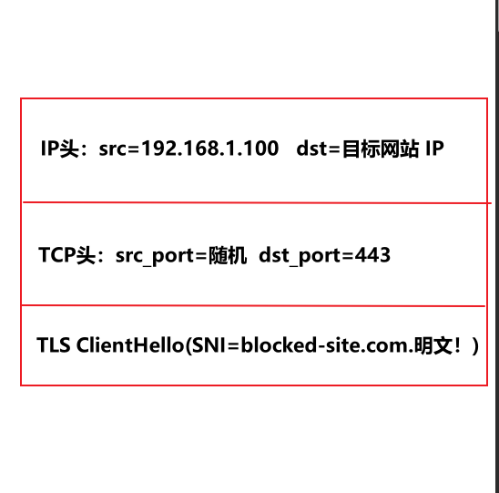
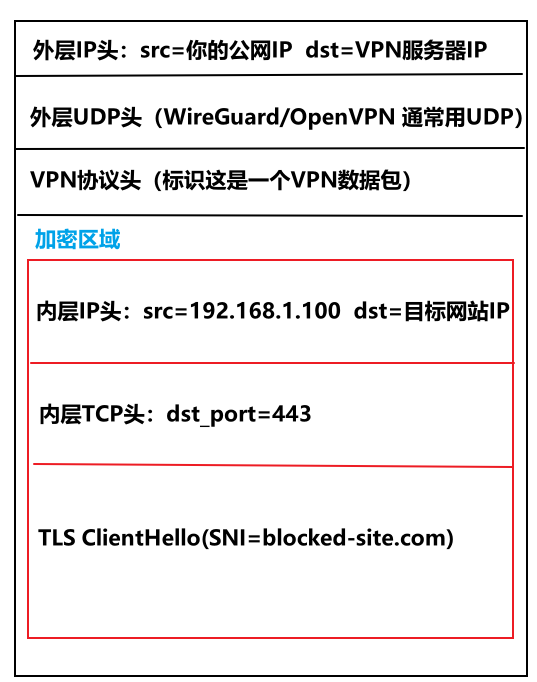
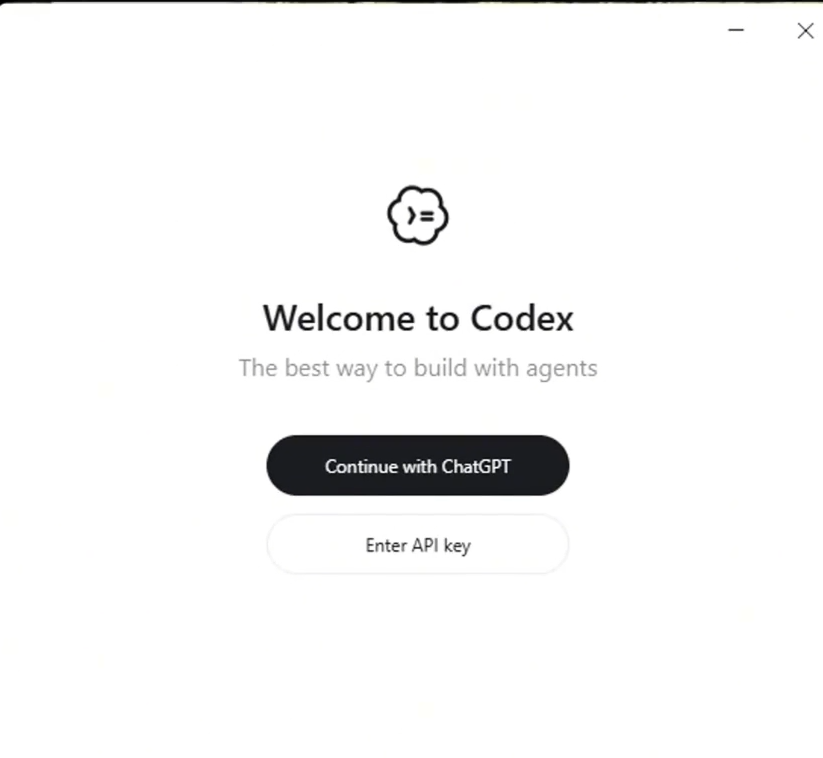

Codex是2025年10月[OpenAI](https://baike.baidu.com/item/OpenAI/19758408?fromModule=lemma_inlink)公司开发的AI代码生成训练模型，基于[GPT-3](https://baike.baidu.com/item/GPT-3/63687636?fromModule=lemma_inlink)架构改进，专注于将自然语言指令转换为多种编程语言代码。该模型通过混合训练自然语言和公开代码数据构建，采用[Transformer](https://baike.baidu.com/item/Transformer/64429264?fromModule=lemma_inlink)架构并具备14KB代码记忆容量，支持[Python](https://baike.baidu.com/item/Python/407313?fromModule=lemma_inlink)、[JavaScript](https://baike.baidu.com/item/JavaScript/321142?fromModule=lemma_inlink)、[Java](https://baike.baidu.com/item/Java/85979?fromModule=lemma_inlink)等主流语言，作为[GitHub Copilot](https://baike.baidu.com/item/GitHub Copilot/57754203?fromModule=lemma_inlink)的技术基础，核心功能包括代码生成、补全优化及多语言翻译。2025年5月升级为云端软件工程代理后，新增并行处理代码编写、调试和测试功能，集成至[ChatGPT](https://baike.baidu.com/item/ChatGPT/62446358?fromModule=lemma_inlink)生态并向企业用户开放。同年6月通过ChatGPT Codex子系统实现多方案生成功能，允许用户为单一任务获取多个代码方案并自主选择最优解。

# 术语介绍

## 	VPN（魔法，科学上网）

vpn的本质为**封装**（把一个 IP 数据报塞进另一个 IP 数据报的载荷里）+ **加密**（让外面那个数据报的载荷不可读）。例如访问`blocked-site.com`

### 不开vpn的网络传输流程

当不用vpn的时候，数据报的样子为：

其中GFW可以看到

- IP 头里的 **目标 IP** —— 判断是否在黑名单
- TLS 握手里的 **SNI**（Server Name Indication，明文传输）—— 直接看到你要访问哪个域名
- 甚至可以做 **DPI**（深度包检测），分析载荷特征

然后 GFW 发一个 RST 包，或者直接丢包，连接就断开了。

### 开vpn的网络传输流程

1. 首先VPN 客户端启动时，会在你的系统里创建一个**虚拟网络接口**（TUN 设备，比如 `tun0`），然后**修改路由表**，把默认路由（或特定 IP 段）指向 `tun0`：`default via tun0          ← 所有流量先走虚拟网卡`

   于是当你的浏览器发出上面那个数据报时，OS 的网络栈不会把它送到物理网卡（`wlan0`），而是送给 `tun0`。而 `tun0` 的特点是：**发到它的数据报不会上线路，而是被交给了 VPN 客户端进程**（用户态程序通过 `read()` 从 TUN fd 读取）。

2. VPN 客户端拿到了那个原始数据报，做两件事：

   1. **加密**：把整个原始 IP 数据报（包括 IP 头）用对称密钥加密
   2. **封装**：把加密后的密文，作为载荷塞进一个全新的数据报里

   结果是这样的（以 tunnel 模式为例）：

   

3. 这个外层数据报从物理网卡（`wlan0`）正常发出，经过你的运营商到达 VPN 服务器。

4. VPN 服务器收到外层数据报后：

   1. 看到外层 IP 头的 dst 是自己 → 接收
   2. 检查 VPN 协议头 → 确认是 VPN 隧道流量
   3. 解密载荷 → 还原出内层那个原始数据报
   4. 把内层 IP 头的 src 改成 VPN 服务器自己的 IP（NAT），然后直接转发给目标网站

5. 目标网站的响应包发回 VPN 服务器（因为请求的 src 被 NAT 成了服务器 IP），服务器再走一遍反向流程：加密 → 封装 → 发回给你 → 你的客户端解密 → 写回 `tun0` → OS 交付给浏览器。

### 为什么VPN能绕过GFW？

GFW 面临的核心困境确实是一个**误杀问题**（false positive）。它不能无差别丢弃所有去往境外 IP 的加密流量，原因是：

- 大量合法服务在境外：GitHub、AWS、Cloudflare CDN、Docker Hub、各种 SaaS
- 跨国企业的内网通信、视频会议（Zoom、Teams）都走加密通道
- 学术机构访问海外数据库、期刊

如果 GFW 把"加密 + 境外 IP"一刀切全封掉，经济损失太大。**这个"不敢乱封"的约束，恰恰就是 VPN 能存活的空间。**

## 大模型和Agent

### Agent

Agent 是一个**能感知环境、自主决策、采取行动来完成目标的系统**。早期基于规则的自动机器人、游戏 NPC 也叫 agent。只是在 LLM 出现后，"AI agent"才真正有了实用的"大脑"。

一个完整 agent 通常包含这几个部分：

- 感知：从环境获取信息--读文件、收消息、看屏幕、调 API 拿数据
- 决策：根据当前目标和感知到的信息，决定下一步做什么。现代 agent 的决策核心通常是大模型，但也可以是规则引擎、搜索算法等
- 行*：执行具体操作--调用工具、运行代码、修改文件、发请求、控制设备
- 记忆：短期记忆保存当前任务的上下文，长期记忆（向量库、数据库）保存跨会话的信息
- 规划：把大目标拆成小步骤，执行后根据结果反馈调整计划，形成"思考→行动→观察→再思考"的循环
- 自主性：这是 agent 和普通程序的核心区别--不是你一步步指挥它做什么，而是你给个目标，它自己决定怎么做

常见的Agent：Codex，Cluadecode。

### 大模型

本质是一个超大规模的神经网络，用海量文本训练出来，核心能力是**根据输入预测下一段文字**。它不"理解"世界，而是学会了语言的统计规律--什么词后面最可能跟什么词、什么问题最可能配什么回答。

几个关键特点：

- 输入输出都是文本：给它文字，它回文字，仅此而已。所谓"会写代码""会推理"，都是文本生成的表现
- 训练完就定型：模型参数固定后，它的知识就停在训练数据截止那天，不会自己更新
- 无状态：每次调用都是独立的，它不记得你上一轮说了啥，所谓"对话"是靠每次把历史拼进上下文实现的
- 不能行动：纯模型只能输出文字，改不了文件、发不了邮件、连不了网
- 规模是关键：参数量、训练数据量到了一定规模，会涌现出小模型没有的能力（推理、指令遵循、少样本学习），这就是"涌现能力"

常见的大模型：GPT-4、Claude、Gemini、LLaMA、Qwen、DeepSeek 等。

### 两者的关系

大模型像是一个博学但被困在玻璃房里的人——你递纸条进去问问题，他写纸条递出来，但碰不到外面的任何东西。

Agent 就是给这个人开了门、装了电话、配了工具箱，还让他可以自己决定先做哪件事。他还是用同一个大脑思考，但能真正把事办成。

大模型决定了 agent 能力的上限，Agent决定了它能发挥出多少。同一个 GPT-5，配简陋工具就是个聊天机器人，配上完整工具链和好的规划逻辑，就是个能干活的 agent。

## API中转站

比如[硅基流动](https://cloud.siliconflow.cn/i/yTIkLdxx)，火山方舟等一系列中转站。

**为什么有人用它**

很多大模型官方 API（比如 OpenAI）在国内无法直接访问，中转站部署在能访问的网络环境里，帮你绕开这个障碍，并且支持多个模型（GPT、Claude、Gemini），用同一个 **APIkey** 调用，特别省事。

**它的工作流程**

1. **你的程序把请求发到中转站的地址（比如 `https://xxx.com/v1/chat/completions`）**
2. 中转站用自己的 key 转发给官方 API
3. 官方返回结果，中转站再转发给你

**需要注意的风险**

你发给中转站的内容会被它的服务器看到，隐私数据可能经第三方的手。并且中转站可能挂羊头卖狗肉。

## **Agent管理工具**

### CC Switch

CC Switch是跨平台开源的‌**AI 编程 CLI 统一配置管理与路由代理工具**‌，支持多工具（Codex/Claude Code 等）一键切换供应商。有了CCswitch，我们就不用在命令窗口一个一个配置Agent了

### **Codex++**

‌是专为 OpenAI Codex 桌面端打造的外部增强启动器与 UI 功能解锁工具 。‌‌其主要功能是解锁codex的插件（原生codex无法加载一些插件，如computeruse，chrome等）

# 下载步骤

## 命令行下载（Codex CLI）

根据此安装方式可以从终端调用codex，但是没有UI界面

`npm install -g @openai/codex`

## 官网下载

https://openai.com/zh-Hans-CN/codex/（需要魔法）也可直接从Microsoft Store下载

# 登录

**命令行进入的场景 即Codex CLI**

输入codex自动进入登陆界面，大部分情况用用自己的APIkey登录，也就是Provide your own APIkey.

登录后，认证信息会保存在`~/.codex/auth.json` 文件中

**UI界面进入的场景**

点击桌面的codex，可以选择用APIkey和用OpenAI的Chatgpt登录，大部分情况用用自己的APIkey登录，也就是Enter API key

# 一些Question

## 关于本地路由映射

**Q：用自己的APIkey，Codex返回response错误**

Codex（OpenAI 的代码助手 CLI）**原生只支持 OpenAI 自己的 Responses API 和 GPT 系列模型**，它本身不认识 DeepSeek、Kimi 这类第三方模型，也不认识 CodingPlan 的 API。

开启了「需要本地路由映射」，CC-Switch 正在做一件事：

- 把你输入的 CodingPlan API，**伪装成 Codex 能识别的 OpenAI 协议**，让 Codex 以为自己在调用 GPT 模型
- Codex 只知道 “这是一个 OpenAI 风格的模型”，就会默认显示它最高支持的模型名（比如 GPT-5.5），**这不是你实际开通了这个模型，只是 Codex 的默认显示**。只是 CC-Switch 做了协议兼容后，Codex 自己 “脑补” 出来的模型名，和 CodingPlan 实际提供的模型无关

那么ccswitch提供的自添加模型名就是修改codex给你显示的他所认为的模型名为实际调用的模型名称

## 手机验证码问题

**Q：在注册ChatGPT的时候，需要国外的手机验证码**

目前主流的绕开验证码的方式全都失效了，唯一能用的就是接码平台了。但是接码平台的号码无法二次验证。很可能有二次验证的时候这个号就废了。看看以后会不会有更好的解决方法。**目前先用第三方API吧**

## 因为编的次数太多了，直接新建一个标题

这种情况就是开梯子了，VPN 开启时会自动写入系统全局代理环境变量 `HTTP_PROXY / HTTPS_PROXY`； Codex、Ccswitch 会自动读取这组变量，强行把本地路由请求再次走外网代理，链路彻底断裂。

