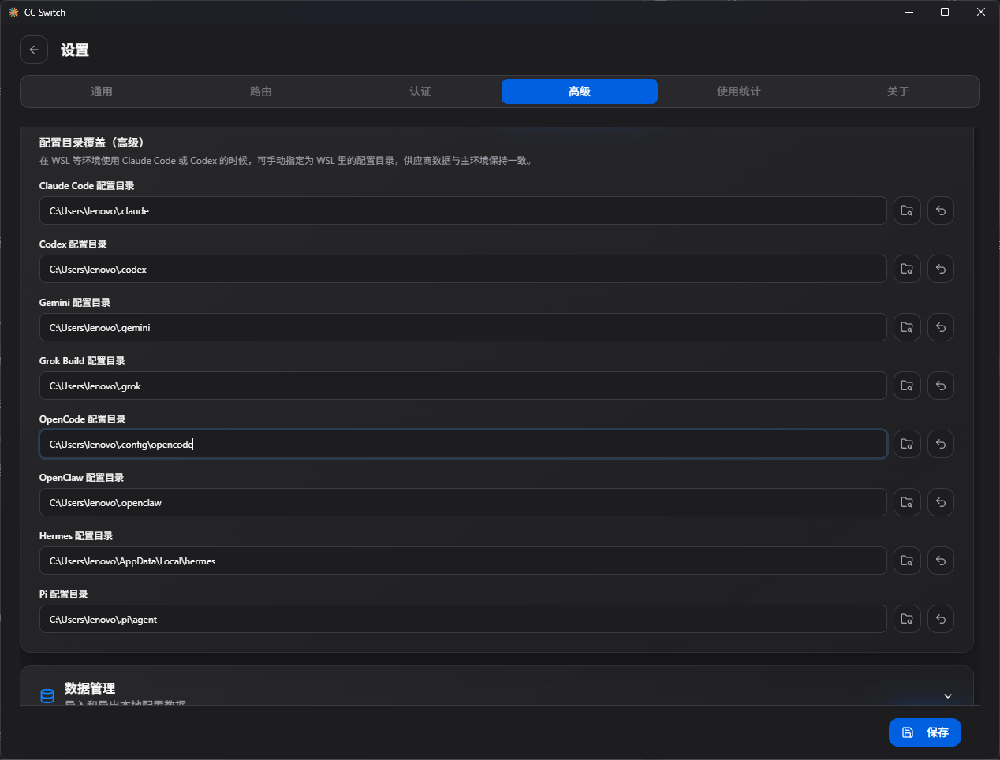

# main.py

```python
if hasattr(sys.stdout, "reconfigure"):
    sys.stdout.reconfigure(encoding="utf-8")

def parse_args():
    parser = argparse.ArgumentParser(description="A minimal SixSixAgents chat client.")
    parser.add_argument("--prompt", help="Send one message and exit.")
    parser.add_argument("--model", help="Override the model name.")
    parser.add_argument(
        "--system",
        default="You are SixSixAgents, a helpful and concise assistant.",
        help="Override the system prompt.",
    )
    return parser.parse_args()


def main():
    args = parse_args()
    agent = Agent(model=args.model, system_prompt=args.system)

    if args.prompt:
        print(agent.chat(args.prompt))
        return

    print(f"SixSixAgents ready. Model: {agent.model}")
    print("Type 'quit' to exit.")

    while True:
        try:
            message = input("You: ").strip()
        except (EOFError, KeyboardInterrupt):
            print()
            break

        if not message:
            continue
        if message.lower() in {"quit", "exit", "q"}:
            break

        try:
            print(f"SixSixAgents: {agent.chat(message)}")
        except Exception as exc:
            print(f"Request failed: {exc}")


if __name__ == "__main__":
    main()
```

## hasattr（）

作用：如果最后输出结果不是utf-8编码，自动改变为输出utf-8编码。

`hasattr(sys.stdout, "reconfigure")`：检查这个输出流有没有 `reconfigure` 方法。因为不是所有输出对象都支持这个方法，不加检查直接调用可能报 `AttributeError`。

## parse_args()

```python
py -3.12 main.py --model deepseek-ai/DeepSeek-V3.2 --system "只回答中文" --prompt "你好"
```

读取并解析你从命令行传给 `main.py` 的参数，然后把参数整理成一个对象返回。

这一串命令里有三部分信息：

- `--model deepseek-ai/DeepSeek-V3.2`：这次用哪个模型
- `--system "只回答中文"`：Agent 的身份规则
- `--prompt "你好"`：只发这一句，然后退出

## main()

```
 except (EOFError, KeyboardInterrupt)
```

1.  **`KeyboardInterrupt`**

   触发场景：用户在终端按 **`Ctrl + C`**

   - 系统抛出 `KeyboardInterrupt`
   - 正常不捕获的话，程序直接崩溃退出并打印一堆报错栈
   - 捕获之后：执行 `print()`（换行美化），然后 `break`，跳出 while 循环然后程序结束

2. **`EOFError`**

   触发场景：EOF = End Of File 文件结束 触发场景：用户在终端按 **`Ctrl + D`**（Linux/macOS）；Windows 是 `Ctrl + Z` 然后回车

   - 代表标准输入结束，没有更多输入了
   - input()` 读取不到内容，抛出 EOFError
   - 捕获后退出

```python
 except Exception as exc:
```

将异常重命名为`exc`

# utils.py

```python
DEFAULT_MODEL = "deepseek-ai/DeepSeek-V3.2"
OPENCODE_CONFIG = Path.home() / ".config" / "opencode" / "opencode.json"
```

这句代码指的是我的ccswitch中保存的我的中转站配置的llm的json文档。里面有APIKEY，还有请求协议格式



## load_opencode_settings()

```python
 for provider in config.get("provider", {}).values():
        options = provider.get("options", {})
        if not options.get("apiKey") or not options.get("baseURL"):
            continue

        model = next(iter(provider.get("models", {})), None)
        return {
            "api_key": options["apiKey"],
            "base_url": options["baseURL"],
            "model": model,
        }

    return {}
```

**`model = next(iter(provider.get("models", {})), None)`**

`provider.get("models", {})`:从`provider`中找到`models`的标签

`iter(provider.get("models", {}))`:把找到的`models`给变成迭代器的形式

`next(iter(provider.get("models", {})), None)`:取迭代器的第一个值，要是没有值，取`none`

**其实可以看出，apikey和baseURL都在options里 **

## class Agent

### def  \_\_init\_\_

```python
settings = load_opencode_settings()

        api_key = os.getenv("OPENAI_API_KEY") or os.getenv("openai_api_key") or settings.get("api_key")
        base_url = os.getenv("OPENAI_BASE_URL") or os.getenv("openai_base_url") or settings.get("base_url")
        self.model = model or os.getenv("OPENAI_MODEL") or os.getenv("openai_model") or settings.get("model") or DEFAULT_MODEL

        if not api_key:
            raise RuntimeError(
                "API key not found. Set OPENAI_API_KEY or configure ~/.config/opencode/opencode.json."
            )
        if not base_url:
            raise RuntimeError(
                "API base URL not found. Set OPENAI_BASE_URL or configure ~/.config/opencode/opencode.json."
            )

        http_client = httpx.Client(timeout=60.0)
        self.client = OpenAI(
            api_key=api_key,
            base_url=base_url,
            timeout=60.0,
            http_client=http_client,
        )
        self.messages = [{"role": "system", "content": system_prompt}]
```

**`os.getenv`**：在系统里读取环境变量

**`OpenAI()`**:这是OPENAI给提供的接口形式

### def chat

```python
 self.messages.append({"role": "user", "content": message})

        try:
            response = self.client.chat.completions.create(
                model=self.model,
                messages=self.messages,
            )
        except Exception:
            self.messages.pop()
            raise

        answer = response.choices[0].message.content
        if not answer:
            raise RuntimeError("The model returned an empty response.")

        self.messages.append({"role": "assistant", "content": answer})
        return answer
```

**`self.messages.append({"role": "user", "content": message})`**:)这里选择append函数是因为想保留上下文

**`self.client.chat.completions.create`**:

```python
self.client                  # OpenAI 客户端对象
self.client.chat             # 聊天相关接口模块
self.client.chat.completions # 聊天补全接口模块
self.client.chat.completions.create  # 创建聊天补全的方法
```
