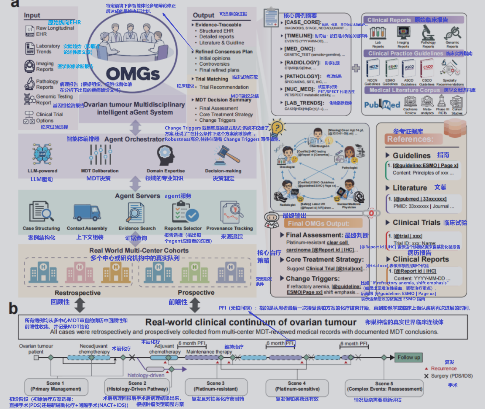
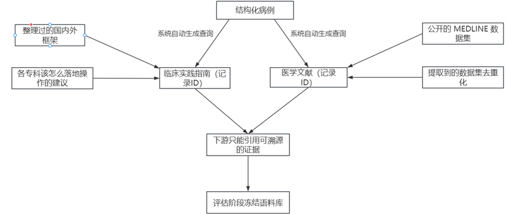
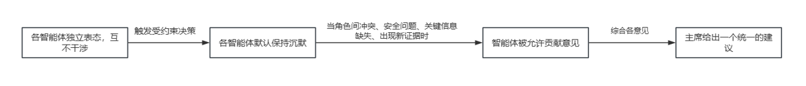

[Download PDF](妇科多智能体.pdf)

# 背景

## 现实医学背景

> **MDT**：MDT 的全称是 Multidisciplinary Team，可理解为多学科团队协作。团队通常包含外科、肿瘤内科、放疗科、影像科、病理科等医生，有时护士、营养师、心理医生也会加入。大家围坐讨论，避免单一科室决策的局限。

卵巢肿瘤的管理越来越依赖于多学科肿瘤委员会MDT的讨论，以应对需要手术、肿瘤内科、影像、病理、分子检测多学科协同治疗。并且此病症有三个特别棘手的特征：晚期诊断、显著的肿瘤异质性、频繁复发。这些特征意味着患者在整个病程里需要反复面对高风险决策。然而全球大多数患者缺乏及时的专家共识,尤其在资源受限的中心。MDT 资源稀缺甚至完全不可用。

于是，本文提出了OMGs（卵巢肿瘤多学科智能体系统），多智能体AI框架，通过协调多学科的证据，用于给出透明依据的MDT式的建议

## AI决策支持的四个挑战

> In this context, single-agent large language model (LLM) assistants may be insufficient to ensure that recommendations remain consistently verifiable and traceable across incomplete and evolving longitudinal records.
>
> 单agent大语言模型助手在零散且不断演变的纵向记录中，可能无法保证建议始终可验证和可追溯。因此需要多agent设计来应对这些挑战。

开发卵巢肿瘤AI决策支持系统面临几个固有挑战，这四个挑战也直接决定了OMGs的设计方向：

1. 用agent进行仿照MDTs的讨论得出对病人的具体分析，这项任务具有多学科性，需要跨专业进行针对特定角色的推理，并在解释出现分歧时进行协调。
2. 在整个护理过程中，决策空间会随着临床场景的变化而变化，包括初步管理、组织学驱动的路径、铂类耐药复发、铂类敏感复发以及事件驱动的重新评估。
3. 输入agent数据具有纵向性，且可能不完整，分布在时间顺序的报告中，存在数据缺失、不确定性和评估不一致的情况。
4. 临床部署需要透明度和可追溯性，将建议与可验证的患者特异性证据联系起来，并明确指出不确定性和重新评估，以支持问责和审计。

# 为什么选择多智能体

上述四个挑战中，多学科性需要角色分工（挑战1），纵向不完整数据需要显式标注缺口和矛盾（挑战3），透明度需求需要可追溯的证据链（挑战4）。多智能体架构恰好能逐一对应这些需求。

### LLM天然适配MDTs

> Such systems naturally fit the MDTs and enable seamless integration of multimodal clinical data, external knowledge bases, and case repositories through coordinated tool use, while reconciling conflicting perspectives via structured reasoning and evidence attribution.
>
> 此类系统自然契合多学科团队（MDTs）的需求，通过协同使用工具，实现多模态临床数据、外部知识库和病例库的无缝集成，同时通过结构化推理和证据归因来调和相互冲突的观点。

### 比单智能体更有效率

> Compared with single-agent approaches, a multi-agent design may better structure role-specific reasoning and facilitate evidence-grounded reporting, which is hypothesized to improve auditability under fragmented records.
>
> 与单agent相比，多agent设计可能更有利于构建特定角色的推理结构，并促进基于证据的报告，这被认为可以提高零散记录下的可审计性。
>
> **可审计性**：当病历又碎又缺时,多 agent 把推理拆成几个角色各自负责的部分,缺口和矛盾被不同 agent 显式挑出来,而不是埋在一个黑箱里--这样事后追溯"建议怎么来的、哪里可能出错"就更容易。

# OMGs系统的实现

## 系统概述

OMGs采用两层架构：

- **Agent编排层（Orchestrator）**：协调五个专科agent进行结构化MDT审议。五个角色分别是主席（Chair）、肿瘤内科（Medical Oncology）、影像科（Radiology）、病理科（Pathology）和核医学科（Nuclear Medicine），每个agent配备特定领域的专业知识和精选临床数据。
- **Agent服务层（Agent Servers）**：支持临床数据提取、上下文组装、证据检索、报告选择和来源追踪。

收到患者病例和纵向临床记录后，编排层协调五个专科agent各自从自己的领域分析病例。每个agent从临床实践指南、生物医学文献和试验注册库中检索与其专科相关的证据。<u>随后agent进行多轮、有证据支撑的审议</u>，每个专家可以质疑、澄清和修正其他人的解读，以达成共识，模拟真实MDT会议的动态。

系统最终输出结构化决策摘要，包含三部分：最终评估（Final Assessment）**、**核心治疗策略（Core Treatment Strategy）和变更触发条件（Change Triggers），均与可追溯的证据来源关联。

## 临床输入处理

> **文档级来源元数据**：系统从病历里提取每一条信息时，都会给它贴一个"标签"，记录这条信息是从哪份文档、什么日期的文档里提取出来的。
>
> - `value`: 高级别浆液性癌
> - `document_type`: 病理报告
> - `document_date`: 2025-03-01
>
> 这个 `(document_type, document_date)` 就是文档级来源元数据，即这条数据从哪来的。 因为卵巢癌患者的病历是纵向的，同一个指标在不同时间可能有不同结果（比如化疗前后肿瘤标志物变化、影像评估变化）。有了这个标签，系统输出的建议里如果引用了某个发现，可以追溯到具体是哪一天哪份报告说的
>
> **结构化病例**：把一堆格式各异、散落在各处的文档，整理成一份字段固定的、机器能直接读懂的标准格式。
>
> 

对于每个病例，OMGs将纵向EHR文档转换为以<u>索引MDT日期</u>（即记录的MDT讨论日期）为基准的结构化病例摘要。系统对原始病历（包含异质临床文档和元数据）应用EHR结构化函数，生成规范化的病例表示。

使用预定义的病例模板，LLM从每份文档中提取显性事实，输出符合schema的JSON，缺失或不支持的值记录为"Unknown"。提取的条目保留<u>文档级来源元数据</u>（如文档类型和文档日期），以支持结构化字段到原始材料的可追溯性。条目按模态和时间规则进行标准化和合并，<u>不补全不可用的信息</u>。

## 角色范围信息访问与证据检索

为反映真实MDT的边界，系统强制执行<u>角色范围访问</u>：从结构化病例表示和预定义源文档中打包专科特定的输入。专科agent仅限于访问与其角色相关的输入，而主席agent可以访问自己的角色范围包，并在审议期间整合跨专科的贡献，最终进行仲裁和综合。

外部医学知识通过<u>受控证据检索模块</u>纳入，由结构化病例schema生成的查询驱动，查询锚定于疾病背景、临床场景和既往治疗暴露。检索到的证据组织为两个互补的流，从两个预分块、语义嵌入的语料库中使用嵌入相似性搜索检索：

- **临床实践指南**：精选并协调主要国际和国家框架，增强专科特定建议
- **医学文献**：来自MEDLINE基线数据集，优先考虑高级别临床证据（Cochrane综述、荟萃分析、III期随机对照试验、设计良好的队列研究）

检索到的条目经过去重、过滤和规范化，存入<u>证据库</u>，分配稳定标识符和PMID（如有）。为避免评估期间的时间漂移，每个评估阶段使用的指南语料库和证据库索引都是固定的。

## 多智能体受约束审议

基于结构化病例表示、角色范围输入和集中证据库，系统进行<u>受控多角色审议</u>，模拟MDT治理而非自由形式的agent交互。

每个角色agent首先独立产出角色特定的评估和建议，明确说明安全考虑、关键不确定性和可追溯的支撑文献。随后进入<u>受约束审议阶段</u>：agent默认保持沉默，仅在满足预定义条件时才被允许发言，包括：

- 角色间冲突
- 安全问题
- 关键信息缺失
- 新发现的决策相关证据

所有干预都是角色定向的，并明确标注理由，确保交流聚焦且可审计。

主席agent随后调和跨专科分歧，综合出统一的MDT式建议，以schema约束的形式表达：

$$
Y = (\text{Final Assessment},\; \text{Core Treatment Strategy},\; \text{Change Triggers})
$$

OMGs最终吐出来的建议，固定由三块内容组成。

- **最终评估**（Final Assessment）：回答"这个病人现在什么情况"。

  比如：IIIC期高级别浆液性卵巢癌，BRCA1突变阳性，HRD阳性，首次诊断，未接受过治疗。

- **核心治疗策略**（Core Treatment Strategy）：回答"接下来怎么治、为什么这么治"。

  比如：先行新辅助化疗（卡铂+紫杉醇）3-4周期，随后行中间性肿瘤减灭术（IDS），术后继续化疗并以奥拉帕利维持治疗。理由：肿瘤广泛腹腔播散，不适合直接手术（PDS）；BRCA突变阳性，PARP抑制剂维持治疗有生存获益。

- **变更触发条件**（Change Triggers）：回答"什么情况下要重新评估或改变方案"。

  比如：若2周期化疗后CA-125未下降，需重新评估化疗敏感性；若影像提示疾病进展，考虑更换为非铂方案；若出现严重骨髓抑制，需调整剂量。

最终评估总结调和后的疾病状态和风险分层，核心治疗策略指定选定的管理路径及其临床理由，变更触发条件定义需要重新评估或升级的明确临床或安全条件。Y的每个元素都必须附带可追溯的证据引用。

## 伦理审查与学习监督

> **去标识化**：去标识化(de-identification)就是把病历里能认出"这是哪个病人"的信息删掉或替换掉,只留下临床内容,这样数据可以拿来做研究而不侵犯病人隐私。

本研究在所有参与中心的机构审查委员会获得了伦理批准。

- **回顾性分析**：因研究仅使用完全去标识化的数据且风险极低，获得了知情同意豁免（FUSCC伦理批件 2601-Exp365）。
- **前瞻性队列**：入组前获得书面知情同意（FUSCC 2508-Exp538、SFMIH KS25394、FOGH 2025-152）。

OMGs系统以严格的<u>非干预性和观察性</u>方式评估，其输出离线生成，不向临床医生披露，也不用于临床决策。所有OMGs运行均使用为研究评估准备的去标识化病例包，系统不接收任何直接的患者标识符。

# 评估设计

## 五个临床场景

> **初步管理**：病人刚确诊卵巢肿瘤,要决定怎么治。最核心的决策通常是:
>
> - 直接手术(PDS):先开刀尽量切干净肿瘤,再化疗;
> - 先化疗再手术(NACT+IDS):肿瘤太大或扩散太广,先用化疗缩小,再做手术。
>
> **组织学驱动的路径**：手术或活检拿到病理组织学类型后,不同类型的卵巢肿瘤走完全不同的治疗路线:
>
> - 高级别浆液性癌：化疗+维持治疗(PARP 抑制剂/贝伐珠单抗),看 BRCA/HRD;
> - 透明细胞癌：化疗效果差,处理更激进;
> - 生殖细胞肿瘤：用 BEP 方案,要考虑保生育;
> - 性索间质肿瘤：可能不需要化疗;
> - 交界性肿瘤：通常手术就够了,不化疗。
>
> **铂类耐药复发**：病人治疗后癌症复发了,而且对铂类化疗药已经耐药(定义:完成铂类化疗后 6 个月内复发)。铂类是卵巢癌的基石药物,一旦耐药,可选择的方案很少,是临床最棘手的情况。
>
> **铂类敏感复发**：病人复发了,但对铂类仍然敏感(定义:完成铂类化疗后 超过 6 个月才复发)。这种情况可以再用铂类化疗,选择更多、预后更好。
>
> **先验分配**：的意思是分配规则在评估开始前就定死了，防止研究者事后看到结果再调整分类来美化数据。这是评估严谨性的要求，和训练/测试划分无关。

所有合格患者被先验分配到五个预定义MDT临床场景之一，场景分配规则在评估前定稿，并在所有中心和阶段统一应用：

1. **初步管理（Primary management）**：初次诊断后的治疗路径决策
2. **组织学驱动路径（Histology-driven pathways）**：基于病理类型分流不同治疗路线
3. **铂类耐药复发（Platinum-resistant relapse）**：铂类化疗后6个月内复发
4. **铂类敏感复发（Platinum-sensitive relapse）**：铂类化疗后超过6个月复发
5. **事件驱动重新评估（Event-driven reassessment）**：复杂事件需要重新评估

这个系统能支持卵巢肿瘤MDT决策，那到底测了哪些类型的决策？如果只测了"刚确诊的病人怎么治，那不知道系统在复发场景下行不行。<u>五个场景就是五个不同类型的临床决策难题，铺满了患者整个病程。</u>

## 队列与数据来源

> **回顾性队列**：这些是已经<u>治完的病人的历史病历</u>。系统拿这些旧病历跑一遍,生成建议,然后和已有结论比
>
> **前瞻性队列**：这些是<u>正在入组、正在做 MDT 讨论的病人</u>。系统在病人真实诊疗过程中同步生成建议
>
> 其中队列就是给OMGs的病例库。304例回顾性 + 59例前瞻性，这些患者的真实病历就是OMGs要处理的"考题"。

**回顾性队列**

来自FUSCC（复旦大学附属肿瘤医院）253，NJPH（苏北人民医院）30，TFPH（台州市第一人民医院）21。筛选了去标识化的真实世界临床记录。共<u>304</u>例，中位年龄55.0岁（IQR 47.0-62.0），上皮性卵巢癌占82.2%，其余包括交界性肿瘤、生殖细胞肿瘤、性索间质肿瘤等。

**前瞻性队列**

FUSCC（复旦大学附属肿瘤医院）39，FOGH（复旦大学附属妇产科医院）10，SFMIH（上海市第一妇婴保健院）10纳入接受常规MDT讨论的患者。共纳入<u>59</u>例，中位年龄56.0岁（IQR 50.0-65.0），组织学分布与回顾性队列相似。

## 四阶段评估框架

> **单中心**：只用了一家医院（FUSCC）的数据
>
> **多中心**：扩到了三家医院（FUSCC、NJPH、TFPH）
>
> **回顾性**：病人已经治完了，拿历史病历回头测
>
> **基准测试**：和几个"参照物"对比，建立性能基准。这里的参照物是三个单agent基线（CHAIR-R/E/D），目的是隔离出"多智能体审议"本身带来了多少增益
>
> **re-MDT**：重新组建一个MDT小组，用同样的病例资料重新讨论一遍。这批医生没参与过当时的原始MDT，相当于"盲考"
>
> **前瞻性**：和回顾性相反。病人正在治疗、正在做MDT讨论，系统同步跑，不是回头拿旧病历
>
> **人机协作**：医生先用OMGs辅助写一份建议，再和不借助OMGs时自己写的比

评估分为四个顺序阶段，逐步提高外部有效性和工作流真实性：

| 阶段      | 设计                   | 目的                                           |
| --------- | ---------------------- | ---------------------------------------------- |
| Phase I   | 单中心回顾性基准测试   | 量化多智能体审议和信息逐步丰富各自的贡献       |
| Phase II  | 多中心回顾性re-MDT评估 | 跨场景、跨机构、跨基座模型的稳定性与人类一致性 |
| Phase III | 前瞻性多中心评估       | 与常规MDT决策的前瞻性一致性比较                |
| Phase IV  | 人机协作评估           | OMGs辅助对医生建议质量的增量提升               |

# 评估结果

## SPEAR评估系统

本系统开发了一个**SPEAR评估框架**用于系统性评估OMGs的建议质量。并通过这个框架用于展示OMGs和真实MDT的性能比较结果。本框架使用五个维度评分标准进行评估

| 维度                    | 含义                            | 备注 |
| ----------------------- | ------------------------------- | ---- |
| Safety(安全)            | 建议有没有高危错误              |      |
| Personalization(个性化) | 有没有结合这个病人的具体特征    |      |
| Evidence(证据)          | 证据强不强、能不能追溯到来源    |      |
| Actionability(可操作性) | 建议能不能直接落地执行          |      |
| Robustness(稳健性)      | 对缺失/矛盾信息有没有识别和兜底 |      |

总体的决策质量计算为五个维度的平均值
$$
\text{Overall\_raw} = \frac{S + P + E + A + R}{5}
$$

为将安全性作为硬约束，防止高分数掩盖不安全的建议，采用<u>安全门控总分</u>：
$$
\text{Overall}=
\begin{cases}
\min(\text{Overall\_raw},\,S), & S < 3 \\
\text{Overall\_raw}, & S \ge 3
\end{cases}
$$

即当安全分低于3时，总分被安全分封顶。

## Phase I：单中心回顾性基准测试

**数据来源**

复旦大学附属肿瘤医院的253例连续卵巢肿瘤病例

**测试过程**

与三个仅在信息输入上有所不同的单agent主席基线（仅有主席功能）进行了比较：

- **CHAIR-R**：仅使用模式标准化的病例
- **CHAIR-E**：在保持相同结构化病例输入的基础上，增加了外部证据检索
- **CHAIR-D**：进一步增加了包含完整基础临床报告（包括病理、影像、实验室和基因组报告）的病例特异性证据档案以及检索到的证据和可选的候选临床试验列表

<u>三位具有常规MDT实践的妇科肿瘤专家独立对每个病例进行评分</u>，每个维度使用中位数评分。CHAIR-D和完整OMGs框架在索引决策时间点进行输入匹配，包括相同的病例表示、相同的RAG管道、相同的档案来源和标识符以及相同的试验资格输入，因为两边输入完全一样，所以OMGs比CHAIR-D高的那0.29分，只能归因于"多agent审议+主席综合"这个设计本身，不可能是别的原因造成的。

**关键结果**

OMGs在所有五个SPEAR维度上均取得最高平均分。与最强单agent基线CHAIR-D相比，<u>Evidence和Robustness的差距最大</u>：

| 维度            | OMGs | CHAIR-D |
| --------------- | ---- | ------- |
| Safety          | 4.36 | 4.12    |
| Personalization | 4.26 | 4.11    |
| Evidence        | 4.19 | 4.04    |
| Actionability   | 4.18 | 3.92    |
| Robustness      | 4.37 | 3.72    |

高分（>=4）比例方面，OMGs达到Safety 92%、Personalization 89%、Evidence 87%、Actionability 86%、Robustness 97%，而CHAIR-R仅为30%/42%/23%/32%/20%。

安全门控总分：**OMGs 4.27 +/- 0.31**，CHAIR-D 3.98 +/- 0.29，CHAIR-E 3.31 +/- 0.46，CHAIR-R 2.84 +/- 0.58。

场景分层分析显示OMGs在每个场景中均保持总体SPEAR分在4.24以上，而CHAIR-R始终低于3.00。OMGs在所有临床场景中Safety均不低于3，其Safety=3的实例一致对应预定义的记录约束失败模式：系统没安全分低的时候都是被烂病历拖累的，不是OMGs的锅。

> These findings indicate that OMG safety is largely contingent on, rather than independent of, underlying clinical record quality.
>
> 这些发现表明，OMGs的安全性在很大程度上取决于（而非独立于）基础临床记录的质量

## Phase II：多中心回顾性re-MDT评估

> **re-MDT**：一批没参与过当时MDT的资深医生,用同样的病例资料重新讨论一遍。相比较于MDT病人真正治疗决策时的讨论，re-MDT聚焦于研究阶段,回顾性地重新讨论。
>
> **避免self-scoring**：参加 MDT 讨论的人,不能又来给 MDT 和 OMGs 的对比打分。可能参与MDT讨论的人会偏向自己的团队，从而给OMGs打低分。或者他可能"刻意公平"反而给 OMGs 打太高来满足补偿心理。

从Phase II起，为避免self-scoring，SPEAR评分由未参与MDT或re-MDT讨论的独立资深专家共识小组执行。

从FUSCC选取场景均衡的<u>100例子集</u>（每个场景20例）进行跨多个大语言模型的详细基准测试，并在NJPH和TFPH队列上使用相同协议进行外部中心验证。re-MDT评估由专门为重评估目的召集的多学科小组进行，遵循相同的五角色MDT结构，参与的都是具有常规跨机构实践的资深临床医生，且未参与纳入病例的原始MDT讨论。<u>re-MDT结论被视为一个用来对比的标尺，它本身不保证绝对正确。</u>

**核心结果**

在FUSCC re-MDT队列中，基于GPT-5.1的OMGs在所有评估的基座模型中总体决策质量最高。在场景均衡队列（n=100）中，安全门控总体SPEAR分为<u>OMGs 4.45 +/- 0.30</u>，re-MDT 4.53 +/- 0.23。五个场景的配对比较在Bonferroni校正后均无统计学显著差异。

维度层面呈现<u>互补性能谱</u>：OMGs在Evidence和Robustness上得分更高，而re-MDT在Actionability和Personalization上得分更高：

| 维度            | OMGs (GPT-5.1) | re-MDT |
| --------------- | -------------- | ------ |
| Safety          | 4.56           | 4.74   |
| Personalization | 4.26           | 4.76   |
| Evidence        | 4.57           | 3.92   |
| Actionability   | 4.18           | 4.88   |
| Robustness      | 4.70           | 4.37   |

> Higher Evidence scores for OMGs reflect both enhanced traceability and more consistent evidence alignment: the system systematically retrieves guideline- and trial-level evidence and matches it to treatment line, biomarker status, and disease stage, which is difficult to perform exhaustively and document explicitly under routine, time-constrained MDT workflows.
>
> OMG的证据评分更高，这既反映了其可追溯性的增强，也反映了证据一致性更高：该系统能够系统地检索指南和试验层面的证据，并将其与治疗线、生物标志物状态和疾病分期相匹配，而在常规、时间紧迫的多学科诊疗（MDT）工作流程中，很难做到全面检索和明确记录。

其他LLM基座模型的总体SPEAR分范围为2.61到4.14，表现明显更低且变异性更大。跨中心分析（FUSCC、NJPH、TFPH）进一步证实了总体一致性。

**成本与效率**

在相同推理设置下，完整OMGs框架每例中位<u>总token数为134,656</u>（IQR 19,130），中位端到端延迟为155.3秒（IQR 33.1），保持在预定的多学科肿瘤板审议时间范围内。在100例场景均衡的审计病例中，98%未触发Evidence封顶，2%因部分支持的引用被保守封顶为3，无病例被封顶至2或更低。

## Phase III：前瞻性多中心评估

在前瞻性多中心评估中，OMGs的表现接近常规MDT结论。各中心的平均SPEAR差异（OMGs减去MDT）都很小，95%置信区间保持在预定义的等效界值正负0.5分以内。

**59例前瞻性患者**来自三个中心：FUSCC（n=39）、FOGH（n=10）、SFMIH（n=10）。

按场景拆开看，OMGs和真实MDT的差距不大，但差距的方向因维度而异--某些维度OMGs高，某些维度MDT高：

- **Evidence**：OMGs更高，原因是显式来源引用和系统性地检索相关指南、试验和患者级证据
- **Actionability和Safety**：在输入模糊或冲突的复杂病例中略有下降
- 大多数偏差保持在等效界值内，跨复杂度水平没有渐进性负面偏移

以FUSCC前瞻性队列（最大队列，n=39）为例，OMGs和真实MDT呈现互补格局：OMGs在Evidence上更高（4.72 vs 4.49），而MDT在Actionability和Safety上更高（4.79 vs 4.31，4.87 vs 4.51），但所有差距都在等效界值内。而在SFMIH（n=10），OMGs在Safety和Evidence上均达到5.00满分，甚至超过真实MDT--说明在某些中心，系统不仅能追平人类，还能超越。

## Phase IV：人机协作MDT决策

> **亚专科投入**：医院里有没有细分的专科医生。大医院有专门的妇科肿瘤科、影像科亚专科、病理科亚专科，各看各的领域。小医院可能只有一个普外科医生、一个通识影像医生，什么病都看，没有细分。
>
> **正式MDT基础设施**：医院有没有一套常规的多学科讨论机制。大医院有固定的MDT会议时间、固定参与的多科医生、标准化的病例汇报流程。小医院可能根本没有MDT，或者偶尔拉几个人随便聊聊，没有规范流程。

Phase IV评估了OMGs在人机协作工作流中的效果。<u>12名医生参与，包括三甲医院的6名住院医和6名非三甲医院医生。</u>每位医生对相同病例在两种条件下完成建议：仅人工决策 vs OMGs辅助决策。

**核心发现**

在所有组别中，OMGs辅助提高了安全门控总体分，表明患者级端到端决策质量的持续净改善。

以FUSCC前瞻性队列的住院医为例：

- Scenes 1-3中，所有五个SPEAR领域均有改善（校正后P <= 4.8x10^-4），<u>Evidence提升最大</u>
- Scene 4中，除Robustness外其余维度均保持显著
- Scene 5中，除Actionability外其余维度均保持显著

非三甲医院医生呈现类似模式。FOGH和SFMIH的外部队列同样支持该结论。最大的增益出现在<u>Evidence和Robustness</u>，因为这两个维度在亚专科投入或正式MDT基础设施有限时往往最薄弱。

> In this context, OMGs appears to function as a **structured cognitive scaffold**, reducing omission risk and promoting explicit reasoning rather than replacing clinical judgment. The ability to externalize MDT-style deliberation into auditable, evidence-linked text may therefore help narrow practice variability and improve the defensibility of longitudinal decisions in resource-constrained settings.
>
> OMGs在这里起到的是**结构化认知脚手架**的作用：减少遗漏风险、促进显式推理，而非替代临床判断。将MDT式审议外化为可审计的、与证据关联的文本，有助于缩小实践变异性，提高资源受限环境下纵向决策的可辩护性。

# 讨论与启示

## 核心发现

本研究的两个主要发现：

1. **跨场景的决策质量**：在单中心回顾性基准中，OMGs在所有SPEAR维度上优于最强单agent基线，最大增益在Evidence和Robustness。这反映了一个临床现实：在复杂卵巢肿瘤场景中，限制因素很少是命名一个方案，而是<u>论证策略、识别缺失或冲突变量、定义管理应变更条件的能力</u>。在多中心场景均衡队列中，性能保持稳定，前瞻性比较显示尽管临床复杂度增加，与常规MDT结论的偏差仍然适度。

2. **近期临床实用性**：配对人机评估中，医生在OMGs辅助下产出了更高质量的MDT式建议，最显著的改善出现在住院医和非三甲医院医生中。增益在Evidence、Actionability和Robustness维度尤为明显--这些领域在亚专科投入或MDT基础设施有限时往往发展不足。

## 定位：决策支持而非替代

OMGs不定位为自主决策者，而是<u>决策支持脚手架</u>。它在综合最关键的节点上让临床假设、不确定性和证据依赖变得显式。每例155秒的处理时间使OMGs能够在预定的MDT会议前预先生成分析，无缝融入常规临床工作流。

对于MDT资源有限的机构，OMGs提供基于指南的决策支持，保持机构监督的同时实现协作决策。这对缺乏专门MDT基础设施的小型医院尤其有益。此外，系统还发挥着教育作用，记录临床推理、证据来源和重新评估标准，是住院医和初级医生的学习工具。

## 局限性

> In summary, OMGs demonstrates that a multi-agent system with role-specific constraints and traceable evidence can effectively replicate MDT-level decision-making for ovarian malignancies across both retrospective and prospective multicentre evaluations. The system consistently improves clinicians' recommendations in collaborative workflows. Instead of positioning LLMs as autonomous decision-makers, this work presents a model in which these systems enhance MDT deliberation by strengthening evidence integration, managing uncertainty, and improving documentation, while clinicians retain final decision-making responsibility.
>
> 总之，OMGs表明具有角色特定约束和可追溯证据的多智能体系统可以在回顾性和前瞻性多中心评估中有效复制卵巢恶性肿瘤的MDT级决策。系统在人机协作工作流中持续改善医生的建议。这项工作提出的模型不是将LLM定位为自主决策者，而是通过加强证据整合、管理不确定性和改善文档来增强MDT审议，同时由医生保留最终决策责任。

- 所有评估均在中国医疗体系内进行，对不同语言、指南生态系统、处方约束和MDT组织方式的普适性需进一步研究
- 评估为离线非干预性，关注决策质量和一致性，而非对患者预后的因果效应
- Phase IV中，改善主要反映增强的结构化文档、证据表达和失败模式暴露，需要未来随机或交叉设计来分离辅助效应与锚定效应
- 真实世界EHR的碎片化和缺失仍是残余风险的主要来源，系统性能和安全性与输入质量紧密耦合

