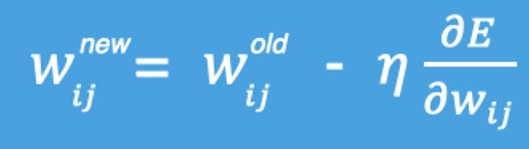

# 神经网络初识

## 特点

一、优点

1. 精度高，性能优于其他的机器学习方法，甚至在某些领域超过了人类
2. 可以近似任意的非线性函数
3. 近年来在学界和业界受到了热捧，有大量的框架和库可供调用

二、缺点

1. 属于黑箱模型，很难解释模型内部的工作逻辑
2. 训练耗时久，对算力要求高
3. 网络结构复杂，需要手动调试大量超参数
4. 在小规模数据集上效果差，容易出现过拟合问题

## 大致演示

同层不同神经元之间拿不到彼此的数据


[神经网络的演示地址](https://playground.tensorflow.org/#activation=tanh&batchSize=10&dataset=circle&regDataset=reg-plane&learningRate=0.03&regularizationRate=0&noise=0&networkShape=4,2&seed=0.76260&showTestData=false&discretize=false&percTrainData=50&x=true&y=true&xTimesY=false&xSquared=false&ySquared=false&cosX=false&sinX=false&cosY=false&sinY=false&collectStats=false&problem=classification&initZero=false&hideText=false)

# 激活函数

激活函数用于对每层的输出数据进行变换，进而为整个网络注入了非线性因素。此时，神经网络就可以拟合各种曲线。如果没有激活函数,不管你堆多少层全连接,整个网络在数学上仍然只是一个线性变换——因为线性变换的复合还是线性变换,`W2(W1x + b1) + b2` 永远可以化简成 `W'x + b'`。所以多层和单层没区别,都只能画直线(或超平面)。

激活函数的作用就是在每一层输出后做一次非线性"扭折",把那个可化简的线性链打断。一旦打断,网络就有了表达弯曲、拐折、复杂边界的能力,这就是万能逼近定理说的 ——足够宽的单隐层网络能逼近任意连续函数。

## Sigmoid函数


```python
 x = torch.linspace(-10, 10, 1000, requires_grad=True)  # requires_grad=True 需梯度以便求导
    fig, ax = plt.subplots(1, 2)  # 1 行 2 列子图
    fig.set_size_inches(12, 4)
    ax[0].plot(x.data, torch.sigmoid(x).data, "purple")  # 左图：sigmoid 函数值
    ax[0].set_title("sigmoid(x)")
    ax[0].spines["top"].set_visible(False)
    ax[0].spines["right"].set_visible(False)
    ax[0].spines["left"].set_position("zero")
    ax[0].spines["bottom"].set_position("zero")
    ax[0].axhline(0.5, color="gray", alpha=0.7, linewidth=1)
    ax[0].axhline(1, color="gray", alpha=0.7, linewidth=1)
    torch.sigmoid(x).sum().backward()  # 反向传播，使 x.grad 为 sigmoid 的导数
    ax[1].plot(x.data, x.grad, "purple")  # 右图：导数
    ax[1].set_title("sigmoid\'(x)")
    ax[1].spines["top"].set_visible(False)
    ax[1].spines["right"].set_visible(False)
    ax[1].spines["left"].set_position("zero")
    ax[1].spines["bottom"].set_position("zero")
    ax[1].set_ylim(0, 0.3)
    plt.show()
```

1. `torch.linspace(start, end, steps)` 的作用是在指定区间内**均匀地取若干个点**。

   `plt.subplots(1, 2)`  为创建一张画布和一组子图,两个数字是"行数、列数":`1, 2` 就是 1 行 2 列,并排放两个子图。它返回两个东西:

   - `fig` -- 整张画布(容器)
   - `ax` -- 子图数组,这里是长度 2 的+数组,`ax[0]` 是左图,`ax[1]` 是右图

   所以代码里能写 `ax[0].plot(...)` 画左边 sigmoid,`ax[1].plot(...)` 画右边导数。如果写 `plt.subplots(2, 2)` 就是 2 行 2 列四个子图,`ax` 变成二维数组,用 `ax[0][1]` 这种方式访问。

   -  `ax[i][j]` 就是"第 i 行第 j 列"那个子图,跟二维数组的习惯完全一致:`ax[0][0]` 左上、`ax[0][1]` 右上、`ax[1][0]` 左下、`ax[1][1]` 右下。
   - 不过注意 `matplotlib` 会自动"压扁"只有一行或一列的情况。 `subplots(1, 2)` 返回的 `ax` 是**一维**的(长度 2),所以用 `ax[0]`、`ax[1]`,写 `ax[0][0]` 会报错。只有行列都大于 1(比如 `subplots(2, 2)`)时,`ax` 才是真正的二维数组,才能用 `ax[0][1]` 两个下标访问	

2. `fig.set_size_inches(12, 4)`

   设置整张画布的物理尺寸,宽 12 英寸、高 4 英寸。因为两个子图是并排的,宽给足、高压低,这样左右两个图各自看起来扁长,适合画函数曲线(横轴跨度大、纵轴变化小)。不设的话 `matplotlib` 用默认尺寸(约 6.4×4.8),两个子图挤在一起会很小。

    `ax[0].axhline(0.5, color="gray", alpha=0.7, linewidth=1)`

   - `0.5` — 在 y=0.5 处画这条线
   - `color="gray"` — 灰色
   - `alpha=0.7` — 透明度,0 全透明、1 不透明,0.7 是淡淡的灰
   - `linewidth=1` — 线宽 1 磅

   放在 sigmoid 的场景里,这条线是有意义的:sigmoid 在 x=0 时正好等于 0.5,而且它是个 S 形从 0 涨到 1 的函数。所以画 y=0.5 这条参考线,能帮你一眼看清"曲线在哪儿穿过中点";代码里紧接着的 `axhline(1)` 则标出 sigmoid 的上限。

   对应的还有 `axvline`(vertical),画竖直参考线,用法一样。

## Tanh函数

.


## RULU函数


```python
    fig, ax = plt.subplots(1, 2)
    fig.set_size_inches(12, 4)
    ax[0].plot(x.data, torch.relu(x).data, "purple")
    ax[0].set_title("relu(x)")
    ax[0].spines["top"].set_visible(False)
    ax[0].spines["right"].set_visible(False)
    ax[0].spines["left"].set_position("zero")
    ax[0].spines["bottom"].set_position("zero")
    torch.relu(x).sum().backward()  # 反向传播求 ReLU 梯度
    ax[1].plot(x.data, x.grad, "purple")
    ax[1].set_title("relu\'(x)")
    ax[1].spines["top"].set_visible(False)
    ax[1].spines["right"].set_visible(False)
    ax[1].spines["left"].set_position("zero")
    ax[1].spines["bottom"].set_position("zero")
    plt.show()
```

## Softmax


可以直接调用

```python
#自定义环境 library/python3-be38bd9cb461ab775f44082e06df14e1
# 整体流程：构造一维输入 → softmax 将原始值转为概率分布（和为 1）→ 打印对比
x = torch.tensor([2.0, 1.0, 0.1])
output = torch.softmax(x, dim=0)  # dim=0：沿第 0 维（唯一维）做 softmax
print("输入：", x)
print("Softmax输出：", output)  # 各元素 ∈ (0,1)，总和 = 1
print("输出之和：", output.sum())
# 二维示例：按行做 softmax（每行和为 1）
x2 = torch.tensor([[1.0, 2.0, 3.0],
                    [1.0, 1.0, 1.0]])
output2 = torch.softmax(x2, dim=1)  # dim=1：沿列方向（每行内部）做 softmax
print("二维Softmax输出：\n", output2)
print("每行之和：", output2.sum(dim=1))  # 均为 1
```

1. softmax 的公式是对每个元素先取指数、再除以指数之和： `output[i] = exp(x[i]) / Σ exp(x[j])`。比如 `[2.0, 1.0, 0.1]` 

   | x    | exp(x) | 除以总和(11.21) | output    |
   | ---- | ------ | --------------- | --------- |
   | 2.0  | 7.389  | 7.389/11.21     | **0.659** |
   | 1.0  | 2.718  | 2.718/11.21     | **0.242** |
   | 0.1  | 1.105  | 1.105/11.21     | **0.099** |

   可获得以下信息：

   - 每个输出都落在 (0, 1),可以当"概率"看
   - 三个加起来 = 1,这就是 `output.sum()` 打印的东西

   还值得注意一点:原始值 `2.0` 是 `1.0` 的两倍,但 `softmax` 之后 `0.659` 是 `0.242` 的约 2.7 倍 -- 指数运算**放大了差距**,大的值优势更明显。这就是 `softmax` 用来挑"最可能的类别"的原因。

2. 二维`dim` 的含义

   ```python
   x2 = torch.tensor([[1.0, 2.0, 3.0],
                      [1.0, 1.0, 1.0]])
   output2 = torch.softmax(x2, dim=1)
   ```

   `dim` 决定沿哪个轴做归一化,也就是让那个轴方向上的元素之和为 1

   - `dim=1` -- 沿列方向,在每一行内部做 `softmax`,所以每行和为 1
   - `dim=0` -- 沿行方向,在每一列内部做,每列和为 1

   `dim=1`,所以分别看每一行。第一行 `[1.0, 2.0, 3.0]`

   ```python
   exp = [2.72, 7.39, 20.09],总和 30.19
   output = [0.090, 0.245, 0.665]   # 3 最大,拿到 0.665
   ```

   第二行 `[1.0, 1.0, 1.0]` 三个相等

   ```python
   output = [0.333, 0.333, 0.333]   # 完全均分
   ```

   `output2.sum(dim=1)` 打印的就是每行之和,两个都是 1。这个例子展示了 softmax 的两种行为:值有差距时"放大优势",值相等时"平均分配"。

# 参数初始化

在训练开始前,给 W 和 b 设一个初始值。我们选择哪个激活函数以及如何初始化参数，可以决定优化算法收敛的速度有多快；糟糕的选择可能会导致我们在训练时遇到梯度爆炸或梯度消失

## 常数初始化

所有权重参数初始化为一个常数，即


这里 `J` 为全1矩阵，*`k` 为初始化的常数。

注意：将权重初始值设为 0 将无法正确进行学习。严格地说，不能将权重初始值设成一样的值。因为这意味着反向传播时权重全部都会进行相同的更新，被更新为相同的值（对称的值）。这使得神经网络拥有许多不同的权重的意义丧失了。为了防止"权重均一化"（瓦解权重的对称结构），必须随机生成初始值。

## 秩初始化

权重参数初始化为单位矩阵，即


这里 *I* 为单位矩阵，即主对角线上元素为 1，其它元素为 0。秩初始化多用于 `RNN` 等需要保持恒等映射的场景，全连接层中较少使用。

## 正态分布初始化

权重参数按指定均值*μ*与标准差*σ*正态分布初始化。因为不能直接将权重初始化为相同的常数，所以需要对参数进行随机初始化。最常见的随机分布就是
**正态分布**（也叫 **高斯分布**），记作 *X* ~ *N*(*μ*, *σ*2)。

其概率密度函数为：


## 均匀分布初始化

权重参数在指定区间内均匀分布初始化。均匀分布一般记作 *X* ~ *U*(*a*,*b*)。

其概率密度函数为：


## Xavier 初始化（Glorot 初始化）

Xavier初始化根据输入和输出的神经元数量调整权重的初始范围，确保每一层的输出方差与输入方差相近。


Xavier 初始化参数适用于 Sigmoid 和 Tanh 等激活函数，能有效缓解梯度消失或爆炸问题。其推导假设激活函数在 0 附近近似线性且对称，因此不适用于 ReLU（输出恒非负，破坏了对称性）。

## He 初始化（Kaiming 初始化）

He初始化根据输入的神经元数量调整权重的初始范围。其方差为 Xavier 的 2 倍，以补偿 ReLU 将一半神经元置零导致的方差减半。


He 初始化参数主要适用于 ReLU 及其变体（如 Leaky ReLU）激活函数。

# 搭建神经网络


## 自定义模型

接口：继承 `nn.Module`，实现 `__init__` 与 `forward(input)`。

功能：所有神经网络模块的基类；自定义模型需继承此类并实现前向传播。

参数：在 `__init__` 中定义子模块与参数，在 `forward` 中接收输入并返回输出。

在神经网络框架中，由多个层组成的组件称之为 **模块（Module）**。在 PyTorch 中模型和各网络层都是 Module。在定义时需主要实现两个方法：

- `__init__`：定义网络各层的结构，并初始化参数。
- `forward`：根据输入进行前向传播，并返回输出。计算其输出关于输入的梯度，可通过其反向传播函数进行访问（通常自动发生）。forward方法是每次调用的具体实现。

```python
class ModelDemo(nn.Module):
    # todo: 1. 在init魔法方法中，完成初始化：父类成员及神经网络搭建。
    def __init__(self):
        # 1.1初始化父类成员
        super().__init__()
        # 1.2 搭建神经网络 → 隐藏层 + 输出层
        # 隐藏层1: 输入特征数 3, 输出特征数 3
        self.linear1 = nn.Linear(3, 3)
        # 隐藏层2: 输入特征数 3, 输出特征数 2
        self.linear2 = nn.Linear(3, 2)
        # 输出层: 输入特征数 2, 输出特征数 2
        self.output = nn.Linear(2, 2)
        # 1.3 对隐藏层进行参数初始化．
        # 隐藏层1
        nn.init.xavier_normal_(self.linear1.weight)
        nn.init.zeros_(self.linear1.bias)

        # 隐藏层2
        nn.init.kaiming_normal_(self.linear2.weight)
        nn.init.zeros_(self.linear2.bias)

    # todo: 1.2 前向传播：输入层 -> 隐藏层 -> 输出层 （forward名字不可更改）
    def forward(self, x):
        # 1.1 第一层 隐藏层计算：加权求和 + 激活函数．
        # 分解版写法．
        # x = self.linear1(x)        # 加权求和
        # x = torch.sigmoid(x)       # 激活函数
        # 合并版写法．
        x = torch.sigmoid(self.linear1(x))

        # 1.2 第2层 隐藏层计算：加权求和 + 激活函数(ReLU)
        x = torch.relu(self.linear2(x))

        # 1.3 第3层 输出层计算：加权求和 + 激活函数(Softmax)
        # dim=-1, 表示按行计算，一条样本一条样本的处理。
        x = torch.softmax(self.output(x), dim=-1)
        return x
```

## 模型训练

#### 查看模型结构和参数数量

接口：`torchsummary.summary(model, input_size, batch_size=None, device='cuda')`

功能：打印模型结构和各层参数数量。

参数：

- `model`：待查看的模型
- `input_size`：输入形状（如 `(3,)` 表示 3 个特征）
- `batch_size`：可选，批大小
- `device`：运行设备

```python
def train():
    # 1. 创建模型对象.
    my_model = ModelDemo()
    # print(f'my_model: {my_model}')

    # 2. 创建数据集样本, 随机生成.
    data = torch.randn(size=(5, 3))
    print(f'data: {data}')
    print(f'data.shape: {data.shape}')  # (5行, 3列)
    print(f'data.requires_grad: {data.requires_grad}')  # False

    # 3. 调用神经网络模型 → 进行模型训练.
    output = my_model(data)  # 底层自动调用了 forward()方法, 进行 前向传播.
    print(f'output: {output}')
    print(f'output.shape: {output.shape}')  # (5行, 2列)
    print(f'output.requires_grad: {output.requires_grad}')  # True
    print('-' * 30)
    # 4. 计算 和 查看模型参数.
    print('==================== 计算模型参数 ====================')
    # 参1: (神经网络)模型对象, 参2: 输入数据维度(5行3列)
    summary(my_model, input_size=(3,))
```

对于这里的`summary`输出值为：

```python
(type)               Output Shape         Param #
================================================================
            Linear-1                    [-1, 3]              12
            Linear-2                    [-1, 2]               8
            Linear-3                    [-1, 2]               6
================================================================
Total params: 26
Trainable params: 26
Non-trainable params: 0
----------------------------------------------------------------
Input size (MB): 0.00
Forward/backward pass size (MB): 0.00
Params size (MB): 0.00
Estimated Total Size (MB): 0.00
----------------------------------------------------------------

进程已结束，退出代码为 0
```

其中：

- `Layer (type)` -- 层的类型和序号。模型有三个 `nn.Linear`(全连接层),按前向传播顺序编号 Linear-1/2/3,对应代码里的 `linear1`、`linear2`、`output`。
- `Output Shape` -- 这一层的输出张量形状。`[-1, 2]` 里 `-1` 是 batch 维(动态,不固定),,`2` 是特征数。
- ⭐`Param #` -- 这一层的可训练参数数量(权重 + 偏置)。

可训练的参数如何计算出来的：`nn.Linear(in, out)` 的参数 = `in × out`(权重矩阵) + `out`(偏置)。

##### `nn.Linear(in, out)` 的参数运算逻辑

拿 `Linear-2` 举例,它是 `nn.Linear(3, 2)`,意思是输入 3 个特征,输出 2 个特征。

**权重矩阵:in × out 个**

把输入想象成 3 个数 `[x1, x2, x3]`,输出是 2 个数 `[y1, y2]`。<span style="color:#FF00FF">每个输出都是所有输入加权求和算出来的:</span>

```python
y1 = w11·x1 + w12·x2 + w13·x3 + b1
y2 = w21·x1 + w22·x2 + w23·x3 + b2
```

看那些 `w`,一共需要 `2 × 3 = 6` 个权重(每个输出 3 个,共 2 个输出)。排成矩阵就是 2 行 3 列,形状 `(out, in)` = `(2, 3)`,所以权重数量 = `out × in` = `in × out`。

**偏置:out 个**

再看 `b1`、`b2`,每个输出配一个偏置,共 2 个 = `out` 个。偏置不乘输入,直接加上去,作用是让直线能上下平移(不固定过原点)。

**加起来**

`in × out`(权重)+ `out`(偏置)= `3 × 2 + 2` = `6 + 2` = `8` 个参数,正好是表格里 Linear-2 那行的 `Param #`。


**总结**

1. 5行3列，代表5个数据，每个数据有三个特征。此为输入层

2. 隐藏层1**接收**上一层所有输出（第一个数据的三个特征），然后把这三个数据整合起来，整合的方法就是用本层的权重（反向传播可不断更新这个权重）和一个偏置值进行训练整合。<span style="color:#FF00FF">单层可训练参数 = 神经元个数 × 上一层的输出数(=每个神经元的权重数) + 神经元个数(=每个神经元1个偏置)</span>

   1. ```python
      样本1: [x1, x2, x3]  ──┐
      样本2: [x1, x2, x3]  ──┤
      样本3: [x1, x2, x3]  ──┼──> 同一个神经元(3个权重+1偏置),每条各算一次
      样本4: [x1, x2, x3]  ──┤
      样本5: [x1, x2, x3]  ──┘
      ```

      神经元看到"3 个特征" , 这个 "3 个特征的加权求和" 操作根据 <span style="color:#FF00FF">GPU/向量化计算（不是写个 for 循环逐条算,而是把 5 条样本摞成一个矩阵,一次矩阵乘法全算完。）</span>被**同时重复执行了 5 次**,每次喂一条样本。

      

3. 隐藏层2重复隐藏层1

4. 输出层重复隐藏层2

5. 取下一个 batch,重复前向传播、算损失、反向传播、更新参数的过程 , 直到所有数据过了一遍(一个 epoch),再开始下一轮 epoch。

# 损失函数

神经网络中，需要以某个指标为线索来寻找最优权重参数；这个指标就是**损失函数（loss function）**。

## 分类任务

### 二分类任务损失函数


### 多分类损失函数自带`Softmax`,其具体公式如下


**具体执行流程如下**


## 回归任务

### MAE

描述预测值与真实值之间差值绝对值的平均


### MSE


### Smooth L1

可以理解为平滑L1函数：


当误差较小时（预测值与真实值之差的绝对值小于1），使用L2 Loss，使得损失函数平滑可导。

当误差较大时时（预测值与真实值之差的绝对值大于1），用L1 Loss降低异常值的影响。

# 梯度下降算法

**梯度下降法（Gradient Descent）**是一种用于**最小化目标函数的迭代优化算法**。核心是沿着目标函数（如损失函数）的负梯度方向逐步调整参数，从而逼近函数的最小值。梯度方向指示了函数增长最快的方向，因此负梯度方向是函数下降最快的方向。所以有：



其中，`η`是学习率，如果学习率太小，那么每次训练之后得到的效果都太小，增大训练的时间成本。如果，学习率太大，那就有可能直接跳过最优解，进入无限的训练中。解决的方法就是，学习率也需要随着训练的进行而变化。
