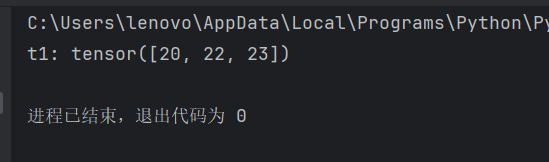

# 张量的类型转换

## 张量转换NumPy数组

```python
def dem02():
    t1 = torch.tensor([1, 2, 3, 4, 5])
    print(f't1: {t1}, type: {type(t1)}')
    # 2.张量-> numpy.
    n1 = t1.numpy()
    print(f'n1: {n1}, type: {type(n1)}')
    # 3.演示上述方式 共享内存。
    n1[0] = 100
    print(f't1: {t1}') # [100, 2, 3, 4, 5]
    print(f'n1: {n1}') # [100, 2, 3, 4, 5]
```


## NumPy数组转换张量

- 使用from_ numpy 可以将ndarray数组转换为Tensor，默认共享内存，使用 copy 函数避免共享。
- 使用 torch.tensor 可以将 ndarray 数组转换为 Tensor，默认不共享内存。（用的多）

```python
def dem02():
    # 1.创建numpy数组
    n1 = np.array([11, 22, 33])
    print(f'n1:{n1},type:{type(n1)}')
    # 2.把上述的numpy数组，转换成张量.
    t1 = torch.from_numpy(n1).type(torch.float32)
    print(f't1: {t1}, type: {type(t1)}')
    t1 = t1.numpy()  # 把t1转换回numpy，然后演示tensor函数的效果
    print(f't1: {t1}, type: {type(t1)}')
    t1 = torch.tensor(n1, dtype=torch.float32)
    print(f't1: {t1}, type: {type(t1)}')
```

## 从张量中提取内容

只能从标量张量中提取内容。也就是这个张量中只能有一个值

```python
def dem02():
    t1=torch.tensor(100);
    print(f't1: {t1},type:{type(t1)}')
    value = t1.item()
    print(f'value: {value},type:{type(value)}')
```


# 张量的数值计算

## 基本运算

### 加减乘除

涉及到的API:

- add(), sub(), mul(), div(), neg()    加减乘除,取反substact，multiply，divide
- add\_(), sub\_(), mul\_() div\_(), neg\_(）功能同上，只不过可以修改源数据，类似于 Pandas部分的inplace=True

需要你记忆的: +，-，*，/

如果是张量和数值运算，则:该数值会和张量中的每个值依次进行 对应的运算. 

```py
def dem02():
    t1=torch.tensor([10,12,13]);
    t1+=10
    print(f't1: {t1}')
```



### 幂运算：pow()、pow_()

接口：`Tensor ** exponent` / `Tensor.pow(exponent)` / `Tensor.pow_(exponent)`

功能：逐元素求幂。`pow()` 返回新张量，`pow_()` 为 in-place。

参数：`exponent`：指数（标量或与张量可广播的张量）

```python
import torch
tensor1 = torch.tensor([1, 2, 3])
print(tensor1 ** 2)   # tensor([1, 4, 9])
print(tensor1.pow(2)) # 同上
tensor1.pow_(2)       # in-place
print(tensor1)        # tensor([1, 4, 9])
```

### 求平方根：sqrt()、sqrt_()

接口：`Tensor.sqrt()` / `Tensor.sqrt_()`

功能：逐元素平方根。`sqrt()` 返回新张量，`sqrt_()` 为 in-place。

参数：无

```python
import torch
tensor1 = torch.tensor([1.0, 2.0, 3.0])
print(tensor1.sqrt())  # tensor([1., 1.414..., 1.732...])
tensor1.sqrt_()
print(tensor1)
```

### 以 e 为底：exp()、log()

接口：`Tensor.exp()` / `Tensor.exp_()`、`Tensor.log()` / `Tensor.log_()`

功能：逐元素以 e 为底求幂（exp）或求自然对数（log）。带下划线版本为 in-place。

参数：无

```python
import torch
tensor1 = torch.tensor([1.0, 2.0, 3.0])
print(tensor1.exp())  # e^1, e^2, e^3
print(tensor1.log())  # ln(1), ln(2), ln(3)
```

### 哈达玛积（逐元素乘法）

接口：`*`、`Tensor.mul(other)`

功能：两张量形状相同或可广播时，对应位置相乘（Hadamard product），与矩阵乘法不同。

参数：`other`：张量或标量

```python
import torch
tensor1 = torch.tensor([[1, 2], [3, 4]])
tensor2 = torch.tensor([[1, 2], [3, 4]])
print(tensor1 * tensor2)   # [[1,4],[9,16]]
print(tensor1.mul(tensor2)) # 同上
```


## 矩阵乘法运算

1. 点乘：
   要求：两个张量的维度保持一致，对应元素直接做相应的操作.
   API:
   - `t1 * t2`
   - `t1.mul(t2)`  # multiply: 乘法

2. 矩阵乘法：
   要求：两个张量，第一个张量的列数，等于第二个张量 的行数(A列 = B行)
   结果：A行B列
   API:
   - `t1 @ t2`
   - `t1.matmul(t2)`
   - `t1.dot(t2)` 扩展：只针对于一维张量有效.

注意：

`X = X @ Y` 会先分配新张量再赋给 `X`；若之后不再使用原来的 `X`，可用 `X[:] = X @ Y` 在原有存储上写入，减少一次分配。确保右边的结果能够正确地广播到左边指定的形状。如果形状不匹配，则会导致错误。

```python
import torch
X = torch.randint(1, 9, (3, 2, 4))
Y = torch.randint(1, 9, (3, 4, 1))
print(id(X))
X = X @ Y      # X 指向新对象，原内存可被回收
print(id(X))   # 与上面不同

X = torch.randint(1, 9, (3, 2, 4))
print(id(X))
X[:] = X @ Y   # 结果写回 X 的存储，id(X) 不变
print(id(X))
```

# 张量的索引操作

## 简单索引与切片

接口：`tensor[i]`、`tensor[:, j]`、`tensor[i:j, k:l]` 等下标与切片语法

功能：单整数索引会使该维消失（降维）；切片保留该维；`:` 表示该维全选。

参数：`i`、`j` 等为整数或切片（start​\:end:step），支持负索引。

```py
tensor1 = torch.randint(1, 9, (3, 5, 4)) 
#这行代码的意思是：创建一个形状为 (3, 5, 4) 的三维张量（Tensor），其中的元素是从 1 到 8 之间的随机整数。
print(tensor1[0].shape)      # (5, 4)：取第 0 维为 0 的片
print(tensor1[:, 1].shape)   # (3, 4)：第 1 维取 1
print(tensor1[2, 1, 3])      # 标量
print(tensor1[1:, 1:4, 0:3].shape)  # (2, 3, 3)：切片
```

## ⭐列表索引

接口：`tensor[[i1,i2,...],[j1,j2,...],...]` 等，下标为整数张量或列表。

- ：表示选择当前所有行/列

- `tensor[[[1],[2]],[3,4]]`:代表把第2行的3，4两列和第3行的3，4两列读出来

- <span style="color:#FF00FF">`tensor[:, tensor[2]>5]`：</span>

  ```python
   # tensor[2] > 5 仅以第3个矩阵（索引2）为条件，生成布尔掩码。
   # 但 tensor[:, mask] 会在所有矩阵（第1、第2、第3个）的相同位置提取数据，而不管其他矩阵在这    些位置的值是否满足>5
   # 结果是所有矩阵在第3个矩阵满足条件的那些位置上的值（共7个位置）。
   # 只有第3个矩阵的对应值保证 >5，而第1、第2个矩阵的值只是巧合出现在这些位置，可能完全不符合      >5 的条件。
      tensor = torch.tensor([
          [[7, 1, 4, 4],
           [4, 8, 2, 8],
           [7, 8, 7, 2],
           [2, 2, 7, 8],
           [7, 2, 2, 2]],
  
          [[1, 2, 2, 3],
           [7, 5, 7, 3],
           [5, 8, 8, 2],
           [7, 4, 6, 7],
           [5, 5, 4, 1]],
           
          [[4, 2, 2, 7],
           [1, 6, 8, 7],
           [7, 1, 6, 2],
           [4, 4, 3, 1],
           [2, 8, 1, 5]]])
      print(tensor[:,tensor[2]>5])
      #	[4, 2, 2, 7],
      #   [1, 6, 8, 7],
      #   [7, 1, 6, 2],
      #   [4, 4, 3, 1],
      #   [2, 8, 1, 5]
      #   [[False, False, False,  True],
      # 	[False,  True,  True,  True],
      # 	[ True, False,  True, False],
      # 	[False, False, False, False],
      # 	[False,  True, False, False]]
      #	得到布尔掩码后返回所有为True的值
  ```

  

功能：多下标按位置配对或广播，可取出不连续或重排后的元素。

参数：各维传入长度相同的整数序列或可广播的整数张量。

```python
	import torch
    tensor1 = torch.randint(1, 9, (3, 5, 4))
    # 取 (1,1)、(0,2) 两行
    print(tensor1)
    print(tensor1[[1, 0], [1, 2]])
    # [[0],[1]] 与 [1,2] 广播，取 4 个位置，结果形状 (2, 2, 4)
    print(tensor1[[[0], [1]], [1, 2]].shape)
```

<span style="color:#FF00FF">下面演示一下三维张量的列表索引计算方法</span>

```python
 tensor = torch.tensor([
        [[7, 1, 4, 4],
         [4, 8, 2, 8],
         [7, 8, 7, 2],
         [2, 2, 7, 8],
         [7, 2, 2, 2]],

        [[1, 2, 2, 3],
         [7, 5, 7, 3],
         [5, 8, 8, 2],
         [7, 4, 6, 7],
         [5, 5, 4, 1]],

        [[4, 2, 2, 7],
         [1, 6, 8, 7],
         [7, 1, 6, 2],
         [4, 4, 3, 1],
         [2, 8, 1, 5]]])
    print(tensor[[1, 0], [1, 2]])
     # 把 tensor 结构拆开：
     #  tensor[0] = [
     #      [7, 1, 4, 4],   # 第0行
     #      [4, 8, 2, 8],   # 第1行 ← tensor[0][1]
     #      [7, 8, 7, 2],   # 第2行
     #      [2, 2, 7, 8],
     #      [7, 2, 2, 2]
     #  ]
     #  tensor[1] = [
     #     [7, 5, 7, 3],   # 第1行 ← tensor[1][1]
     #      [5, 8, 8, 2],
     #      [7, 4, 6, 7],
     #      [5, 5, 4, 1]
     #  ]
     #  所以：
     #  - tensor[1, 1] → tensor[1][1] → [7, 5, 7, 3]
     #  - tensor[0, 2] → tensor[0][2] → [7, 8, 7, 2]
```

## ⭐范围索引（切片）

同上“简单索引”中的切片用法；`start:end:step`、负索引均支持。

```python
import torch
tensor1 = torch.randint(1, 9, (3, 5, 4))
print(tensor1[1:].shape)          
print(tensor1[-1:, 1:4, 0:3].shape) 
```

<span style="color:#FF00FF">下面演示一下三维张量的范围索引计算方法</span>

```python
    tensor = torch.tensor([
        [[7, 1, 4, 4],
         [4, 8, 2, 8],
         [7, 8, 7, 2],
         [2, 2, 7, 8],
         [7, 2, 2, 2]],

        [[1, 2, 2, 3],
         [7, 5, 7, 3],
         [5, 8, 8, 2],
         [7, 4, 6, 7],
         [5, 5, 4, 1]],

        [[4, 2, 2, 7],
         [1, 6, 8, 7],
         [7, 1, 6, 2],
         [4, 4, 3, 1],
         [2, 8, 1, 5]]])
    print(tensor[1:])
    # tensor([[[1, 2, 2, 3],
    #          [7, 5, 7, 3],
    #          [5, 8, 8, 2],
    #          [7, 4, 6, 7],
    #          [5, 5, 4, 1]],
    #
    #         [[4, 2, 2, 7],
    #          [1, 6, 8, 7],
    #          [7, 1, 6, 2],
    #          [4, 4, 3, 1],
    #          [2, 8, 1, 5]]])
    # 记录包含第二三维所有数的第一维的下标1之后的数
    print(tensor[-1:, 1:4, :3])
    # tensor([[[1, 6, 8],
    #          [7, 1, 6],
    #          [4, 4, 3]]])
    #   ┌───────┬──────┬────────────┬────────────────────────────────────────────┐
    #   │ 维度  │ 切片 │    含义    │                  选中内容                   │
    #   ├───────┼──────┼────────────┼────────────────────────────────────────────┤
    #   │ 维度0 │ -1:  │ 最后一个    │ layer 2 (整个 5×4)                         │
    #   ├───────┼──────┼────────────┼────────────────────────────────────────────┤
    #   │ 维度1  │ 1:4 │ 行 1, 2, 3 │ [[1, 6, 8, 7], [7, 1, 6, 2], [4, 4, 3, 1]] │
    #   ├───────┼──────┼────────────┼────────────────────────────────────────────┤
    #   │ 维度2 │  :3  │ 列 0, 1, 2 │ 每行取前3列                                 │
    #   └───────┴──────┴────────────┴────────────────────────────────────────────┘
    #   最终结果 — 从最后一层 (layer 2)，取行 1~3，列 0~2：
```

# 张量的形状操作

# 张量的拼接操作

# 自动微分模块

# 案例-线性回归案例
