# 命令

### pip show 依赖名称

显示某一个依赖安装的位置

### python -m 模块名

把一个 Python 模块（module）当成脚本来运行。

### dir

当前目录的所有文件展示


# 异常

## raise

```python
raise
raise 异常类
raise 异常类("错误信息")
raise 异常实例
raise 异常类("错误信息") from 原因
```


# 输出语句

## print

### f()函数

```python
print(f"SixSixAgents ready. Model: {agent.model}")
```


1. `f"`：f-string 的标记，**f / F** 写在引号前面，表示这个字符串支持嵌入变量 / 表达式。
2. `"SixSixAgents ready. Model: "`：普通文本，原样输出。
3. `{agent.model}`：花括号里面写 Python 表达式
   - 运行时会取出 agent.model 的值，转成字符串替换掉这整块 `{agent.model}`

## input

### strip()函数

作用：删除字符串开头和结尾的空白字符

```python
# 输入："   你好啊   "
s = "   你好啊   "
print(s.strip()) # "你好啊"，首尾空格删掉，中间不变
```

# 文件

## 打开文件的步骤

这里结合`json`中的语法来演示打开文件的步骤

**打开文件，然后把文件转成字符串的形式来操作**

```python
text = file.read_text(encoding="utf-8")  # 读取文件 → 字符串
config = json.loads(text)                      # 字符串 → Python对象
```

`config`是`list`类型

**直接读取这个文件，把文件转成列表来操作**

```python
with open('test1.json', encoding='utf-8') as fp:
    pyth_list = json.load(fp)
```

其中，`fp`是`file`类型，`pyth_list`是`list`类型

**两种方法可以这样写，完全等价**

```python
config = json.loads(LLM_CONFIG.read_text(encoding="utf-8"))
```

```python
with open(LLM_CONFIG) as fp:
    config = json.load(fp)
```

# argparse 库

`argparse` 是 Python 标准库，用来**解析命令行参数**。

典型用途：

```bash
python main.py --model gpt-5.6 --prompt "你好"
```

Python 程序可以通过 `argparse` 获取：

```python
args.model
args.prompt
```

## 基本使用流程

`argparse` 的核心 **3 步**：

```python
import argparse

# 1. 创建解析器
parser = argparse.ArgumentParser(description="一个医学对话智能体")

# 2. 添加参数
parser.add_argument("--model")
parser.add_argument("--prompt")

# 3. 解析命令行参数
args = parser.parse_args()
```

可以记成：

```
ArgumentParser()
      ↓
add_argument()
      ↓
parse_args()
      ↓
args
```

##  ArgumentParser()

```python
parser = argparse.ArgumentParser(
    description="一个医学对话智能体"  
)
```

`description`：用于描述程序的功能。这也是最常用的一个参数，其他参数暂时不用记

## add_argument()

作用：告诉 `argparse`程序有哪些命令行参数

例如：

```python
import argparse


def parse_args():
    parser = argparse.ArgumentParser(description='888')
    parser.add_argument("--name")
    return parser.parse_args()


if __name__ == '__main__':
    args = parse_args()
    print(args.name)

```

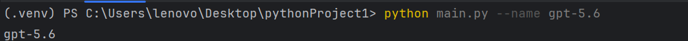

## 位置参数 vs 选项参数

### 位置参数:不带 `--`

```python
import argparse


def parse_args():
    parser = argparse.ArgumentParser(description='888')
    parser.add_argument("name")
    return parser.parse_args()


if __name__ == '__main__':
    args = parse_args()
    print(args.name)

```

运行 `python main.py ZhangSan`正常运行

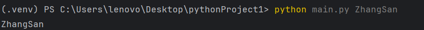

但是当运行`python main.py` 会报错。

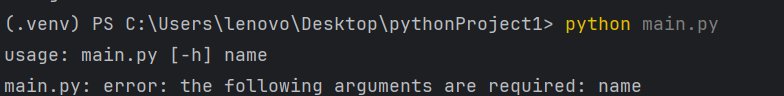

### 选项参数:带 `--`

```python
import argparse


def parse_args():
    parser = argparse.ArgumentParser(description='888')
    parser.add_argument("--name") # 这里不同
    return parser.parse_args()


if __name__ == '__main__':
    args = parse_args()
    print(args.name)

```


但是当去掉参数的时候不会报错，会显示None值。

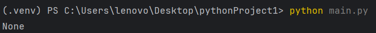


# JSON库

JSON 文件/响应中的内容通常是 JSON 格式的文本（字符串），Python 需要用 `json` 模块把 JSON 文本解析成 Python 对象。转为字典或者列表格式

| 常量、类或者方法名 |                                                           |
| ------------------ | --------------------------------------------------------- |
| json.dump          | 方法，传入一个json对象，将其编码为json格式后储存到io流中  |
| json.dumps         | 方法，传入一个python对象，将其编码为json格式后储存到str中 |
| json.load          | 方法，传入一个json格式的str，将其解码为python对象         |
| json.loads         | 方法，传入一个json格式的str，将其解码为python对象         |

## loads用法

```python
import json

data = '''
[{
    "name": "小明",
    "height": "170",
    "age": "18"
}, {
     "name": "小红",
    "height": "165",
    "age": "20"
}]
'''

# 打印data类型
print(type(data))
# json类型的数据转化为python类型的数据
new_data = json.loads(data)
# 打印data类型
print(type(new_data))

```

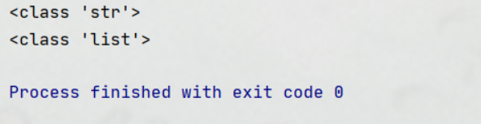


然后我们就可以获得其中的数据了

```python
name = new_data[0]['name']
new_name = new_data[0].get('name')
```

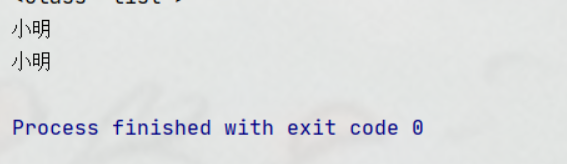


## load用法

注意 ：load方法操作的是整个文件对象，这里是将整个整个文件对象里面的内容转化为json对象。（下图是文件操作对象）

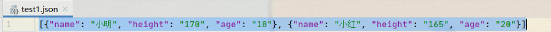

```python
import json
import json
# load的用法是把json格式文件，转换成python类型的数据。
# 构建该文件的文件对象
with open('test1.json',encoding='utf-8')as fp:
    # 加载垓文件对象，转换为python类型的数据
    pyth_list = json.load(fp)
    print(pyth_list)
    print(type(pyth_list))
    print(type(pyth_list[0]))
```

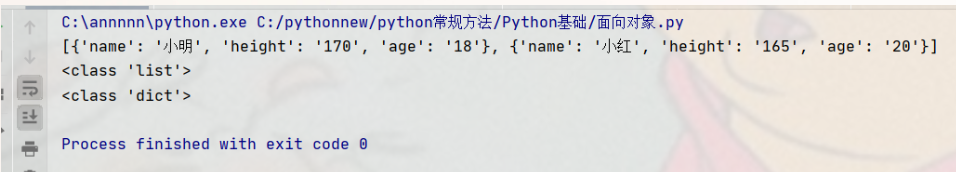

## dumps函数

`json.dumps()`函数，把python类型的数据转换成json字符串

```python
import json

data = '''
[{
    "name": "小明",
    "height": "170",
    "age": "18"
}, {
     "name": "小红",
    "height": "165",
    "age": "20"
}]
'''
# 打印data类型
print(type(data))
# json类型的数据转化为python类型的数据
new_data = json.loads(data)
# 把python类型的数据转换成json字符串
lit = json.dumps(new_data)
# 打印转换后data类型
print(type(new_data))
print(type(lit))

```

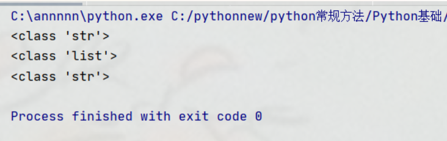

## dump函数

把python类型的数据以json格式储存到文件中

```python
import json
data = '''
[{
    "name": "小明",
    "height": "170",
    "age": "18"
}, {
     "name": "小红",
    "height": "165",
    "age": "20"
}]
'''

# json类型的数据转化为python类型的数据
new_data = json.loads(data)

# 把python类型的数据以json格式储存到文件中
# 构建要写入文件对象
with open('test1.json','w',encoding='utf-8')as fp:
    # 把python类型的数据以json格式储存到文件中，为了输出中文，还需要指定参数 ensure_ascii 为 False
    json.dump(new_data,fp,ensure_ascii=False)

```

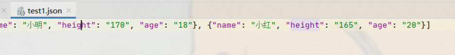

# Http库

## HTTPX

### `httpx.Client(...)`

创建一个可复用的 HTTP 客户端对象。即创建“请求工具”，此时没有访问网络

```python
httpx.Client(
    base_url="https://api.example.com/v1/",
    headers={"Authorization": "Bearer sk-xxx"},
    timeout=60.0,
    follow_redirects=True,
    verify=True,
    proxy=None,
)
```

- `base_url`：统一设置接口基础地址，后面请求相对路径。
- `headers`：放 `Authorization`、`Content-Type` 等请求头。
- `timeout`：设置网络请求超时时间。
- `follow_redirects`：是否自动跟随重定向，默认是 `False`。
- `verify`：HTTPS 证书验证，默认是 `True`，通常不用写。
- `proxy`：需要通过代理访问接口时使用。

## `client.get()`

使用这个工具请求某个 URL

```python
response = client.get(
    "https://example.com/search",
    params={"q": "python", "page": 1},
    headers={"User-Agent": "MyApp/1.0"},
    timeout=10.0,
    follow_redirects=True,
)
```

- `params`：添加 URL 查询参数。

  ```python
  client.get(
      "https://example.com/search",
      params={"q": "python", "page": 1},
  )
  ```

  实际请求地址会变成：`https://example.com/search?q=python&page=1`

  重复参数可以使用列表：

  ```python
  client.get(
      "https://example.com/search",
      params=[("tag", "python"), ("tag", "http")],
  )
  ```

  结果为：`https://example.com/search?tag=python&tag=http`

- `headers`：为当前请求增加或覆盖请求头。

  ```python
  client.get(
      "https://example.com/data",
      headers={
          "Authorization": "Bearer sk-xxx",
          "X-Request-ID": "abc123",
      },
  )
  ```

- `timeout`：覆盖客户端设置的超时时间。

  ```python
  client.get("https://example.com", timeout=5.0)
  ```

  也可以使用详细超时：

  ```python
  client.get(
      "https://example.com",
      timeout=httpx.Timeout(
          connect=3.0,
          read=30.0,
          write=5.0,
          pool=5.0,
      ),
  )
  ```

- `follow_redirects`：指定当前请求是否跟随重定向。

  ```python
  client.get(
      "https://example.com/old",
      follow_redirects=True,
  )
  ```

  

#  虚拟环境 venv

## 问题

不同项目使用的环境不同，如果都放到本地去部署的话，不同项目之间的不同环境会相互覆盖

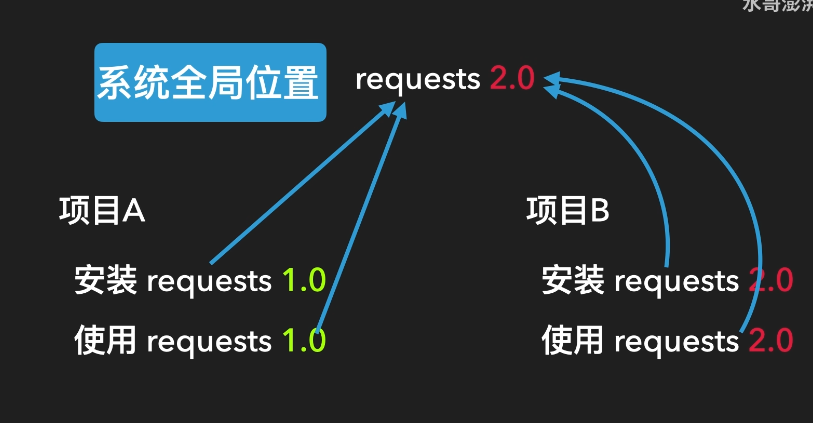

## 解决方法

把各自需要的依赖都放到自己项目的目录中

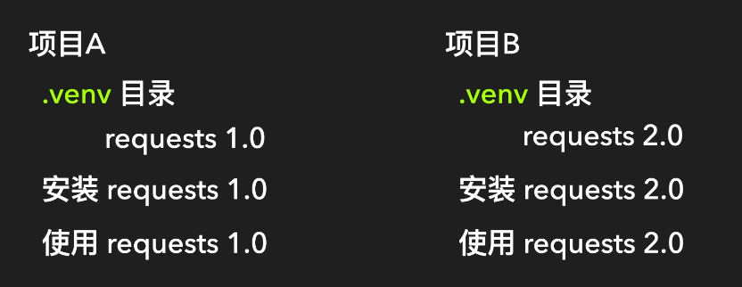

## 实现步骤

1. 项目终端运行`python -m venv .venv`。注意，第一个`venv`不可以改名称，后面的`.venv`是可以改的，默认是`.venv`

2. 项目终端运行`.venv\Scripts\activate`用于激活这个虚拟环境目录，使python在解释的时候用这个目录下的环境

   激活之后可以比较明显的看到这个终端带了一个(.venv)的前缀

   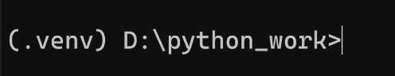

3. 接下来在虚拟环境激活的状态下去安装依赖也是安装到这个目录了

   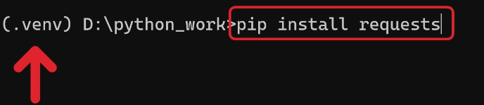

4. 退出命令：`deactivate`。或者直接把cmd窗口guan'diao
