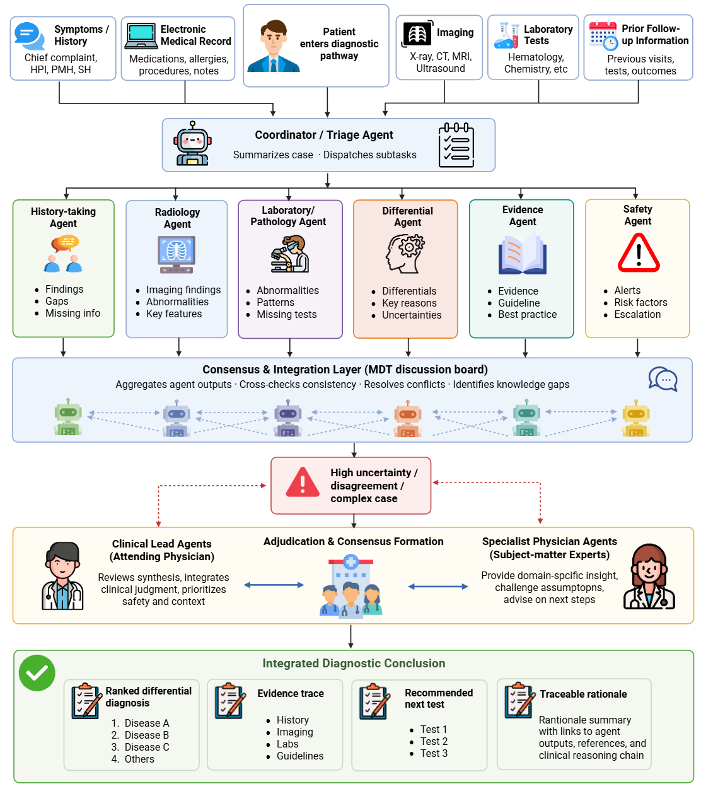
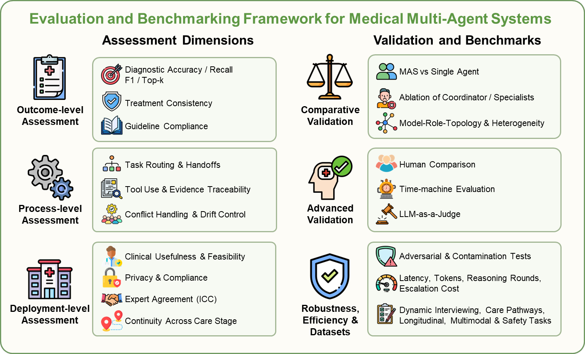

> 这一组决定你对"多智能体""MDT""综述定位"的基本理解。读的时候不要追求记住每个细节，要追求"能用自己的话讲清楚一个完整故事"。

# 目录

| #    | 文献（按参考编号）                                           | 论文原名称                                                   | 对应综述章节      | 要学到的核心内容                                             | 读完要能回答的问题                                        |
| ---- | ------------------------------------------------------------ | ------------------------------------------------------------ | ----------------- | ------------------------------------------------------------ | --------------------------------------------------------- |
| 1    | 44. Konzmann et al. (2026) LLM in tumor boards: systematic review | Applications of large language models in tumor boards: a systematic review | 引言、4.3         | 现有 MDT+LLM 综述怎么定义范围、怎么组织证据、结论是什么；这是你的"锚点综述" | 它与你的综述本质区别是什么？哪些内容是它没覆盖的？        |
| 2    | 33. Guo et al. (2024) LLM-based multi-agents survey          | Large language model based multi-agents: a survey of progress and challenges | 3.1、3.2          | LLM 智能体的定义（工具、RAG、记忆、规划、反思）；多智能体的通用分类 | "智能体"和"多智能体"怎么定义？为什么需要多个智能体？      |
| 3‌✅   | 54. Li, X. et al. (2024) LLM-based MAS: workflow, infrastructure, challenges | A survey on LLM-based multi-agent systems: workflow, infrastructure, and challenges | 3.1、4.5          | 多智能体从工作流、基础设施、挑战三个角度的全景框架           | 多智能体系统为什么难做？瓶颈在哪几层？                    |
| 4✅   | 96. Yao et al. (2026) AI hospitals survey                    | LLM-based multi-agent systems for clinical workflows: a survey of AI hospitals | 3.1、3.3、3.5     | 医疗多智能体如何组织临床工作流；AI 医院类模拟环境如何评测    | AI 医院类工作与肿瘤 MDT 场景的异同？                      |
| 5✅⭐  | 92. Xiong et al. (2026) MAS for medicine: accountable orchestration | Not just one agent: LLM-based multi-agent systems for medicine from answer generation to accountable workflow orchestration | 3.1、4.1          | 医疗多智能体从"生成答案"到"工作流编排"的演变；可问责性       | 医疗多智能体为什么强调"可问责"？                          |
| 6    | 84. Tang et al. (2024) MedAgents                             | MedAgents: large language models as collaborators for zero-shot medical reasoning | 3.2.1、3.4        | 最早的医疗多智能体框架之一：角色化、协作讨论、零样本推理     | 角色扮演为什么能提升医学推理？MedAgents 的流程长什么样？  |
| 7    | 43. Kim et al. (2024) MDAgents                               | MDAgents: an adaptive collaboration of LLMs for medical decision-making | 3.2.1、3.2.3、3.4 | 自适应协作：根据任务难度选择独诊/团队；这是"协作+层级"的交界 | 自适应协作解决了什么问题？它和固定团队的区别？            |
| 8    | 13/15. Chen, K. et al. MDTeamGPT (2025/2026)                 | MDTeamGPT: a self-evolving LLM-based multi-agent framework for multi-disciplinary team medical consultation；MDTeamGPT: mitigating context collapse and enabling self-evolution in medical multi-agent reasoning | 3.2.4、3.4、3.6.2 | 共识聚合+残余讨论+知识库；"上下文崩塌"问题                   | 上下文崩塌是什么？系统怎么缓解？                          |
| 9    | 58. Liu, Q. et al. (2026) EvoMDT                             | EvoMDT: a self-evolving multi-agent system for structured clinical decision-making in multi-cancer | 3.2.4、3.4、4.2   | 自进化 MDT 系统：根据专家反馈和结局信号更新提示词、权重、检索范围 | 自进化在 MDT 中如何实现？它和普通多智能体的差异？         |
| 10   | 85. Vasilev et al. (2025) MTBBench                           | MTBBench: a multimodal sequential clinical decision-making benchmark in oncology | 3.5、4.4          | 肿瘤会诊专用基准：多模态、纵向、证据调和                     | MTBBench 为什么比通用基准更适合 MDT？它测出了什么失败？   |
| 11   | 104. Zhu, Y. et al. (2025) MedAgentAudit                     | Auditing medical multi-agent AI reveals risks of false consensus | 3.2.2、3.6.1、4.5 | 审计多智能体执行日志；虚假一致、沉默同意、未激活专科推理     | 审计发现了哪几类协作失败？为什么"辩论"不一定可靠？        |
| 12   | 27. Gallifant et al. (2025) TRIPOD-LLM                       | The TRIPOD-LLM reporting guideline for studies using large language models | 3.6.4、4.5        | LLM 研究报告的最低报告要求                                   | TRIPOD-LLM 有几个条目？它如何支撑你综述的"评测不足"论点？ |

---

# 文献

## ①A survey on LLM-based multi-agent systems: workflow, infrastructure, and challenges

### 论文框架

论文在引言部分给出一个统一的智能体框架，包含五个部分：

1. Profile：agent 如何被创建和选用？
2. Perception：agent 如何感知环境信息、丰富自己的知识库？
3. SelfAction：agent 如何利用记忆机制储存信息、如何推理复杂任务？
4. Mutual interaction：多 agent 系统中，智能体之间如何相互通信？
5. Evolution：智能体如何通过自我批评实现自我进步？

### MAS算法支撑

每个 agent 都能独立感知环境并做出决策，也可以通过模拟现实世界中的协作模式（合作、竞争、分层组织）与其他智能体交互，从而提高整体协作效率。这类系统通常融合控制理论与强化学习方法实现，MARL 算法是核心。Marllib（论文引用的 MARL 库）用四个维度区分这些算法：

1. task patterns
2. agent types
3. learning styles
4. knowledge sharing

### MAS系统的结构分类

`[25]` 根据 MAS 的特征将其分为两类，这是层次划分：

1. agent-level（智能体层面）：看单个智能体本身长什么样，比如它有哪些能力、是同质还是异质。
2. system-level（系统层面）：看整个系统怎么组织，比如通信方式、控制结构。

`[26]` 用两个维度交叉出四种原型，这是维度划分：

1. agent heterogeneity（智能体异质性）：智能体是全都一样，还是各不相同；

   - homogeneous（同质智能体）：几个智能体能力、角色相同，干类似的活；
   - heterogeneous（异质智能体）：每个智能体有不同专长，靠各自能力互补协作。

   放在 MDT 里看：五个"影像科医生智能体"一起读片子就是同质；一个肿瘤内科、一个影像科、一个病理科组队就是异质。异质组合的价值在于互补。<u>结构越灵活，系统越能适应不同任务和环境变化；异质智能体之间能互补、产生协同效应</u>

2. communication level（通信水平）：智能体之间通信是少还是多、是平级还是分层

其中通信水平可以用 `[23]` 给出的【通信机制 = 通信范式（通信协议）+ 通信结构 + 通信内容】进一步刻画：

- `[27]` 提出通信范式的四维框架，并重点区分了两类系统：
  - blackboard（黑板系统）：所有 agent 共享一块"黑板"，把消息写上去、其他人自己来读，类似共享消息池；
  - message-based（消息系统）：agent 之间直接发消息，点对点传；

- 通信结构分为四种类型：去中心化、集中式、分层、嵌套。

###  MAS profile

#### 上下文生成方法：“先有任务，再定制画像”

根据特定上下文或用户的具体要求，agent 配置文件可能包含不同类型和内容的信息，可以据此生成智能体画像。这种上下文化生成方法会基于复杂任务的环境，灵活决定智能体档案的类型和内容，确保与任务需求对齐。但它是"一次性"的，而且劳动密集：每个新场景都要重新生成一遍智能体档案。

这种做法的成本高，但与任务的契合程度也高。

#### 预定义方法： “先造好人才池，任务来了再挑人”

这种方法先让 LLM 定义多个 agent，共同构成智能体池。面对特定场景时，从池中挑选合适的 agent 执行相关子任务。通常 LLM 会在提示中写明 agent 配置文件的组成和属性，据此生成具有不同特征的 agent；随后由人工或 LLM 挑选合适的 agent；最后 LLM 负责更新智能体的状态信息，方便它们恢复或继续之后的操作。

这种做法的成本低，但与任务的契合程度也低。

#### 基于学习的方法

介于前两种方法之间：在为特定场景定义 agent 配置文件的同时，也能省下大量时间。不过生成新智能体时存在潜在问题，比如大模型幻觉、生成的配置文件与相应任务不匹配。

### MAS Mutual interaction

MAS 的相互交互可以分为三个基本组成部分：

- Message Delivery（消息传递）
- Interaction Structure（交互结构）
- Interaction Scene（交互场景）

#### Message Delivery

消息通常以文本形式记录和传输，也有一些工作整合了多模态信息，比如视觉和音频数据。消息的内容会随任务分配和交互场景动态变化，通常包含历史和当前状态信息，以及其他智能体的通信消息。

消息传递通常由任务分配、与其他智能体的交互或外部控制信号触发；智能体也可以先把消息存进共享内存池，让其他智能体从中检索。
#### Interaction Structure

交互结构定义了多智能体系统内的通信框架，通常基于消息内容进行组织和安排，给智能体分配不同的角色与责任。交互结构可分为四种类型：

- 分层式（Hierarchy）：不同级别的智能体扮演不同角色，高级和低级之间有明确区分。高级智能体通常做监督，负责关键决策，向下级智能体发布指令。这种模式模仿传统组织结构，通过明确划分权力和责任边界来提高效率。

- 去中心化（Decentralized）：智能体在不需要中央权威的对等网络中直接相互通信。这种结构促进智能体之间的平等，交互更灵活、更动态，还能减轻单个大语言模型的计算负担、增强系统鲁棒性；不过在大规模系统中，协调和通信开销会变得明显，可能影响整体性能。

- 集中式（Centralized）：由一个或一组中心智能体协调整个系统，管理和编排所有智能体之间的交互。控制权集中简化了决策过程、避免潜在冲突、提高整体效率；但系统依赖中心智能体，容易单点故障、受通信延迟影响，难以快速响应环境变化。

- 共享消息池（Shared Message Pool）：智能体通过共享消息池发布和订阅信息，按需获取相关信息，不需要点对点直接通信。好处是通信过程简化、信息传递的复杂性降低、消息管理统一；但多个智能体同时访问共享消息池，可能带来争用和同步问题。

#### Interaction Scene

按场景内容，MAS 中的交互可分为三类：

- 通信场景（communication）：智能体通过交换信息进行协调和决策。信息交换可以是直接的，比如通过特定通信渠道传输每个智能体的状态、计划和建议；也可以是间接的，比如共享关于环境、任务或其他智能体的知识。

- 任务执行（task execution）：关注智能体如何按照预定义的任务分配执行特定行动，比如角色扮演游戏、分布式任务分配等。

- 环境探索（environment exploration）：要求智能体利用感知和学习机制，在未知环境中不断适应和优化自己的行为，既包括模拟环境，也包括真实物理环境。

按场景中智能体之间的关系，又可分为三类：

- 协作式（Cooperative.）：智能体共同工作以实现共同目标。现有的多智能体协作模型主要分为：

  - 无序协作：搭一个允许多个 ChatGPT 实例通信、提供反馈、集体思考的网络，让智能体自然协作，不设固定角色分工。
  - 有序协作：把标准操作程序（SOPs）编码成提示序列，让智能体按分配的角色和专业知识执行特定任务。

- 对抗型（Adversarial.）：智能体之间是竞争关系，各自追求自身利益最大化。基本流程包括目标设定、策略制定、交互游戏和结果评估：先设定目标最大化自身利益，再根据对手的行为基准制定竞争策略；交互游戏阶段通过交互实施策略，争取最大利益；最后评估结果、调整策略应对后续竞争。

- 混合型（Mixed.）：结合协作与对抗的特点，要求智能体在合作与竞争之间找平衡，可再细分为并行和层次化两种：

  - 并行（Parallel）：多个智能体在不同任务上独立协作，共享一部分信息但互不干扰。每个智能体负责生成答案的独立部分，最后汇总成完整响应，响应生成快、效率高。
  - 层次化（Hierarchical）：智能体之间呈树状结构。父节点设定全局目标、分解任务并分配给子节点；子节点执行具体任务并提供反馈；父节点根据反馈调整全局策略，优化整体任务执行。

### MAS Evolution
#### Evolution source

##### Environment Feedback.（环境反馈）

环境反馈指智能体在现实世界或虚拟环境中感知到的信息，通常是智能体的决策和行动改变了环境之后产生的变化信息。这类反馈充当奖励信号，告诉智能体行动的后果。

##### Agents Interaction.（智能体交互）

在多智能体系统中，交互信息指智能体之间协作信息的交换，包括其他智能体对某个智能体决策或行动的评估、状态更新，以及智能体之间的上下文通信。

##### Human Feedback.（人类反馈）

人类反馈是由人提供的指导性信号，用来引导智能体做出更好的决策和行动，从而提升其认知能力。

#### Evolution methods

##### Fine-tuning（微调）

- Full Fine-tuning（全模型微调）：更新预训练模型的所有参数，让它适应特定的新任务。计算上昂贵、耗时，新任务数据有限时还有过拟合的风险。
- Repurposing（重新使用）：通常只对预训练模型的特定层（一般是高层）做微调，低层保持不变。
- Additional Parameter Fine-tuning（额外参数微调）：给原始模型加一组额外参数（Adapter、LowRank Adaptation（LoRA）、Prefix Tuning），不改预训练参数也能高效微调。

##### Feedback Learning（反馈学习）

反馈学习把反馈信息当作上下文，让智能体无需更新权重即可迭代"强化"策略生成。

##### Prompt Engineering.(提示词工程)

用精心设计的提示和反馈作为上下文线索。只优化提示、不改模型权重，就能显著提高模型性能。做法是给输入提示添加特定前缀，让模型生成时参考更多上下文信息，输出更相关、更准确。

##### Reinforcement Learning.（强化学习）

强化学习里，智能体通过与环境的交互学习最优策略。每个行动都会产生相应的反馈（奖励或惩罚），智能体据此不断调整策略，最大化累积奖励。核心是试错和优化：通过多次试错，逐渐学会在不同情境下做出最优决策。

#### Agents adjustment

进化机制的一个关键方面，是持续更新智能体现有的知识和经验，或在执行前优化当前的决策和行为。目的是加深智能体的认知能力，增强它对复杂、动态环境的响应能力；通过迭代学习和适应，智能体能在不断变化的情境中保持性能。

##### Memory Update.（记忆更新）

一种重要做法是扩展、加深智能体的自我意识和学习经验：让智能体利用<u>记忆机制，</u>基于收集到的反馈进行自我反思，经过抽象、总结和综合，把新获得的知识和经验存进记忆或外部数据库。

##### Self-Reflection.（自我反思）

以往的研究大多在加强智能体零样本任务决策和高效执行的能力；一种更通用的做法是，让智能体根据反馈和通信记录调整自己的初始目标和规划策略，实现动态演进。

##### Dynamic Generation.（动态生成）

有些情况下，重点是让多智能体系统自主维护、持续运行。考虑到环境的复杂性，系统可以动态生成或移除执行特定任务的智能体，调整系统规模。
## ②LLM-based multi-agent systems for clinical workflows: a survey of AI hospitals

### 论文框架

论文提出了人工智能医院（AI hospital）的概念：

人工智能医院指工作流程级的多智能体临床模拟或部署，具有明确的角色、跨交接的共享状态、基于证据的工具、安全门和纵向跟踪。这是"像医院一样运转"的最低条件。一个系统可以只做<u>会诊、分诊、出院、医学教育或心理健康随访</u>，但只有当它的行动被组织为"跨角色、跨阶段、有持久上下文、有明确问责、有可审计日志"的流程时，才算进入 AI hospital 的范围。

| 步骤              | 干什么                                                       |
| ----------------- | ------------------------------------------------------------ |
| Triage（分诊）    | 判断紧急程度，收集第一份结构化信号，例如急危重症等级、红旗警示、初步证据链接 |
| Consult（会诊）   | 更新初步诊断，把证据链接到建议的行动，并明确还需要澄清什么   |
| Discharge（出院） | 把当前方案转化成患者指导、随访计划和升级标准                 |

<u>不同于医疗保健聊天机器人，这里的重点是明确的状态和切换、操作感知评估，以及作为分阶段协议而不是松散声明的部署准备情况。</u>

普通的医疗保健机器人

- 关注"模型能不能答对问题"；
- 每个回答、每轮对话基本独立，答完就算完；
- 评测以最终答案的准确率、F1、人工评分为主；
- 说"可以部署"往往只靠一个 benchmark 分数，算是一个"松散声明"（loose claim）。

AI hospital

- 病例不是"问一句答一句"，而是有持久状态：分诊产生急危重等级，会诊更新初步诊断并附上证据，出院把方案转成随访计划；
- 不只看最终诊断准不准，还看过程与运营指标：交接完整性、证据覆盖率、升级是否及时、该阻止而没阻止、延迟、人工介入次数、日志能否回放；
- 论文不承认"benchmark 高 = 能部署"，而是给出 IRL1–IRL6 的分级协议：先在模拟环境（IRL1–2），再到真实数据影子回放、人机共决试点（IRL3–4），最后才限范围上线、多中心铺开（IRL5–6）；每一级晋升都必须提供指定证据，比如回放证据链、升级召回率、零 PHI 泄露、漂移监控等，达不到就卡在那一级。
### 系统设计规范

#### 角色和交接

第一个设计决策是：工作流程是否真正需要多个角色。单个代理可能足以完成狭窄的、低风险的步骤，再加上强有力的人工审查。当案例跨越护理阶段、专业或批准边界时，多代理结构就有用了：所有权会变化，下一个角色必须继承明确的状态，而不是去猜。

1. 面向患者的角色：决定哪些信息进入工作流程。价值不只是多几个专业人员，而是能明确责任归属、把专业领域的预设前提摆到明面上，并在工作流程继续推进之前化解分歧。
2. 规划和编排角色：把案例分解为多个步骤，确定还缺哪些信息，并对案例进行接待、分类、咨询或后续处理。当系统必须协调多个本地决策时，比如分诊输出决定咨询代理下一步问什么、或哪个服务接收患者，这些角色非常有用。
3. 评判、批评和记录角色：当工作流程需要明确的协调、指南检查或可审计的摘要，而不是一轮自由形式的讨论时，法官、评论家、决策和记录角色就有用了。实践中，多智能体开销主要在这些责任函数可测量时才合理，而不只是当模型能生成更多推理分支时。

⭐ 在这一步我们要有一个大概的设计，即这个病例应该有几个agent负责？

#### 记忆、证据和工具

第二项设计考量是，确定角色交接完成后，下一岗位需要获取哪些信息。完成分诊之后，接手的咨询处理人员不应该再去揣测病情危急程度信号、现存问题、已开具的检查项目，以及当前诊疗方案背后的依据。下面的设计思想让实例可以恢复、证据可以归属：

1. 长期记忆和证据来源（Long-term memory and evidence sources.）：设计问题不只是"知识存在哪里"，还有如何恢复每个支持项、给它们做版本控制、并把它们和后续操作联系起来。
2. 工作记忆和切换恢复（Working memory and handoff recovery.）：工作记忆携带跨角色的活动案例状态。实际中就是摘要、中间决策、证据 ID、悬而未决的问题和升级标记，让新代理可以恢复工作流程，而无需从头重建。
3. 执行和验证工具（Execution and verification tools.）：它们把"计划该不该通过"变成可以在流程里执行的检查，并且能记录"过了没有、依据是什么、是谁执行、用的哪个版本的指南"，相当于多智能体系统里的"安检门"。
   - 临床决策树、计算器：对分诊、剂量、禁忌证做显式的指南检查，比如"这个剂量是否超指南上限"；
   - 虚拟 EHR 工具：在受控环境里模拟读写电子病历，暴露证据来源和阶段性失败；
   - LLM-as-KB 式工具：用 LLM 当知识库做灵活综合，但一旦进入工作流，必须带显式溯源（provenance）。
4. 多模式和研究工具（Multimodal and research tools.）：它们不是"提高一点准确率的插件"，而是把证据和行动变成可审计的工作流对象——每次工具调用都要留下日志、来源、版本，以后能回放、能追责。
   - 多模态工具：把影像、病理切片、传感器等非文本证据和后续推理绑定，确保诊断结论确实锚定在"系统看到了什么"上，比如影像报告必须有 image-to-report 链接、图片 ID、预处理版本；
   - 研究工具：执行代码、结构化分析、研究自动化，比如跑数据分析脚本、做统计计算，主要用于科研工作流，强调过程可复现。

⭐    在这一步我们应该把agent的权威性树立起来

证据访问工具负责"找到依据"；

执行/验证工具负责"这一步能不能过、能不能执行"；（不是泛泛的"能不能执行医学决策"，而是"这步决策能不能通过显式规则检查并留下执行痕迹"）

多模态工具负责"图片/传感器证据没有脱离决策链"；（不是"判断决策是否在医学范畴"，而是"判断决策是否锚定在真实观察到的证据上"）

研究工具负责"科研动作可复现"。

#### 推理、控制和升级

第三个设计决策是控制。重点不在于推理看起来有多复杂，而在于指导行动的政策是什么。在类似医院的工作流程中，系统必须在继续执行、要求缺失证据、放弃、升级之间做决定。因此，有用的可观察结果是遗漏、分歧、弃权、证据覆盖、延迟和回滚行为。

1. 直接推理（Direct reasoning.）：任务明确、指导面稳定时，单路径推理效果最好。
2. 多路径推理（Multi-path reasoning.）：工作流程确实存在多方专业视角差异，或还有悬而未决的不确定性时，可以用并行分支、充分研讨或投票机制处理。
3. 反馈来源（Feedback sources.）：反馈来自临床医生、工具、知识库，或交互中的后续回合。外部反馈通过新证据或专家修正更新计划。
4. 控制策略与关卡（Control policies and gates.）：一套实用的系统不是一味增强推理，而是提供一个自主权限调节旋钮，界定工作流何时继续执行、何时请求补充缺失依据、何时选择不做判断、何时向上升级处置。

### 临床直接工作流（工作流的设计）

主要临床工作流类别，差异在于系统<u>处于诊疗路径的哪个环节，以及哪一类故障风险占主导地位</u>。同一架构在某一类工作流下可能表现尚可，换到另一类就会显得脆弱，因为工作流不同，对交接质量、证据关联和升级处置策略的要求也不同。

1. 端到端临床工作流仿真与虚拟病房：这类场景和分诊、会诊、出院这套实际运行案例最贴近。系统必须补全缺失的临床证据，在多轮交互里更新诊断假设，并跨多个角色、多个诊疗阶段保存业务状态。这类方案的核心价值在于<u>阶段级可观测性</u>：不只是对最终输出打分，还能定位证据缺失的位置、交接失效的环节，以及本应触发升级处置的节点。

2. 会诊、多学科协作与复杂决策：当专科特有约束或持续存在的临床不确定性，让单一推理路径容易失效时，这类工作流就显得重要。代表性系统会主动追问补充信息、动态更新鉴别诊断、整合结构化临床证据，或针对罕见复杂病例召集多学科团队会诊。

3. 分诊、患者分流、诊疗交接与出院沟通：这类工作流受业务运行约束影响最大。输入信息噪声多，审批权责边界频繁出现；评判质量的标准是交接信息是否完整、下游环节是否可用，而不是单一诊断结果。面向患者的交接任务（出院告知与随访准备）把这一点体现得最明显：系统必须留存已确定的诊疗结论、已向患者告知的内容，以及仍需升级处置的事项。这类场景里，工作流日志是任务定义的固有组成部分，不是事后附加的产物。

### 人工智能模型的评估和部署的准备

AI 医院场景下的模型评估，正从孤立的考试式测评，转向交互式患者任务、覆盖多类临床任务的基准套件、虚拟电子病历（virtual-EHR）环境，以及前瞻性预实验研究。针对工作流级系统，评估对象不只是最终输出，还包括各执行步骤与交接环节的行为表现。

我们把上述评估信号整理成四层评估体系：安全层、流程层、结果层、运维层。以「分诊→会诊→出院」这条业务流程举例：

- 安全层：判断危险诊疗建议是否被拦截；
- 流程层：核查每一步是否携带完整业务状态与证据依据；
- 结果层：判断最终处置方案或健康宣教内容是否准确、具备实用价值；
- 运维层：统计该工作流产生的时延、Token 开销以及人力成本。

所以同一次模型运行记录要支持复现回放、审计核查与运行分析，而不是只输出一个最终分数。

#### 从模型能力到工作流可观测指标

在某个场景里，一项模型能力是否有价值，取决于它能不能改变<u>工作流可观测指标</u>、日志采集要求，或可被合理赋予的自主权限等级。只说"推理更好、检索更多、工具用得更勤"不够。有用的声明是：系统现在能<u>安全地做什么、必须记录哪些额外证据，以及哪种更强的自主声明变得合理</u>。

1. 改变工作流可观测指标（workflow observable）：某个能力让系统在流程里的可测量行为变好了，例如高危步骤不再默默确诊而是正确推迟/升级、会诊输出开始带病历链接的证据、下一个角色拿到的交接更干净、医嘱能带溯源执行。
2. 改变日志采集要求（logging obligation）：因为这项能力，出现了"必须新增记录什么"的义务，例如要记录理由编码的弃权（reason-coded abstention）、升级精确率/召回率、工具成功/失败、跨模态一致性、工具/指南版本。
3. 改变可被合理赋予的自主权限等级（level of autonomy that can be justified）：这项能力让系统"有资格"往上走一级自主权限，例如从"人说了算"到"自动建议但高危步骤必须人工批准"，再到"有监督的自主执行"。

论文给的具体例子（Table 2）：

| 能力              | 应出现的可观测工作流变化                  | 要记录的日志/指标                              | 支撑的更强自主声明              |
| ----------------- | ----------------------------------------- | ---------------------------------------------- | ------------------------------- |
| 更好的校准/弃权   | 高危步骤推迟或升级，而不是默默确诊        | 理由编码弃权、升级精确率/召回率、override 结果 | 需要批准的试点/受监控的高危门控 |
| 证据锚定检索      | 会诊/出院输出带病历链接证据而非无引用断言 | 引用覆盖率、证据门通过率、引用与记录一致性     | 可回放证据链的影子评估          |
| 长上下文/纵向状态 | 后续角色拿到更干净的交接、跨就诊可回放    | 交接完整性、回放成功率、跨就诊一致性           | 纵向影子回放、多就诊评估        |
| 可靠的工具/计算器 | 受管制的检查和行动带溯源执行              | 工具成功/失败、指南依从率@步骤、回滚率         | 分诊/医嘱/出院检查的受控使用    |
| 多模态锚定        | 影像类判断链接到真实观察到的证据          | 跨模态一致性、影像到报告链接                   | 影像/监控工作流的可审计提交     |

所以这句话可以简单理解成：<u>"模型更厉害"不是结论，只有当它变成"流程里能看见、能记录、能支撑更高自主级别"的变化时，才算有价值。</u>

#### 基准（benchmark）分数高 ≠ 可以部署

基准问的是"在一个设计好的任务里，它能不能表现好"；部署就绪问的是"把回放、升级、运营一起检查之后，它声称的那级自主权还站得住吗"。放在 MDT 里：某 MDT 系统在诊断准确率基准上拿了高分，不等于它能在会诊里安全运行——你还要看它跨专科交接是否完整、遇到分歧有没有正确升级、有没有能回放的证据链和过程/运营日志。

#### 基于IRL的从沙盒环境到正式部署

把部署拆成三个阶段、六个等级（IRL1–IRL6）。IRL 阈值是"协议默认值"，不是普适常量，必须按任务风险、站点政策、基线对照、可接受失败预算来校准；所以它更像"治理模板"，而不是一劳永逸的数字。每个等级规定两件事：允许的最高自主权是什么，以及要晋升到下一级必须先拿出什么证据。

三个阶段：

1. Simulation（模拟）：IRL1 静态/脚本化沙盒、IRL2 加噪声/缺信息/对抗性模拟。系统只能在沙盒里跑，重点看"不安全输出率、越狱抵抗、引用覆盖率"。
2. Replay / Pilot（回放 / 试点）：IRL3 在真实数据上影子回放（模型提出、人决定，无实时影响）、IRL4 有限的人机共决试点（低风险步骤可自动建议、高风险步骤必须人工批准）。证据开始要求"可回放证据链、交接完整性、升级召回率、零 PHI 泄露"。
3. Rollout（铺开）：IRL5 限范围上线、带端到端监控（自动默认 + 例外人工复核）、IRL6 跨站点/多语言规模化（有监督自主 + 定期审计）。要求漂移仪表盘、事件响应、跨站点一致性、ROI。

#### 合成数据用于生成/压力测试用的证据不是部署用的证据

合成数据用于训练和压力测试：生成对话、工作流状态转换、缺信息病例、交互模式——这些在真实数据里往往很难大规模采集。在医疗里能扩大覆盖范围、减少直接隐私暴露。但合成数据有明确局限：合成工作流会扭曲真实分布，prevalence（疾病比例）、coordination patterns（协作模式）、error surfaces（错误面）都可能和现实不一样。所以在沙盒生成的"看似成功"的表现，不能直接外推到真实环境。

"用合成的假病历跑通了一次会诊"根本不等于"这系统能在真实病房上线"；合成数据只是训练和压测的好工具，不能拿来证明部署就绪。

#### 失败的五种模式和路线图

AI hospital 的失败很少只出在单个模块里，而是表现为跨角色、记忆、工具、控制的"工作流级崩溃"。

五种失败模式（Table 5）

| 失败模式                                                  | 是什么                                                       | 最先出现在哪                      | 设计应对                                                     |
| --------------------------------------------------------- | ------------------------------------------------------------ | --------------------------------- | ------------------------------------------------------------ |
| Longitudinal drift（纵向漂移）                            | 把历史状态和当前状态混在一起、跨次就诊不一致、无法重建"后来的动作为什么由之前的动作推出" | 随访、慢病、心理健康交互          | workflow-aware 记忆 + 可回放的纵向痕迹                       |
| Capacity-blind planning（无视容量的规划）                 | 方案在临床上说得通，却忽略床位、人力、转运延迟、队列负载     | 床位管理、路由、转病房            | 压力测试影子回放、队列感知模拟、TTD/吞吐量/延迟尾部不回归检查 |
| Ungated deviation / weak escalation（无门控越轨、弱升级） | 偏离指南却不说明理由，或高危病例该弃权/升级却没做            | 分诊、出院、预授权、剂量          | 指南版本化、理由编码的越轨日志、引用覆盖率、升级精确率/召回率 |
| Untraceable action chains（不可追踪动作链）               | 交接、医嘱、EHR 调用失去溯源，事后无法重建"谁在什么证据、什么版本/权限下操作的" | EHR 联动动作、医嘱、交接          | provenance-first 连接器、签名交接、回滚状态                  |
| Drift, jailbreak, cost shock（漂移、越狱、成本冲击）      | 部署后护栏行为漂移、提示被越狱、token/延迟成本失控导致不安全或不可用 | 任何有外部用户/工具的已部署工作流 | 定期红队测试、越狱通过率、回滚手册、成本护栏、canary 发布    |

系统通向可审计、可负责任部署的路线图

短期进步不靠"多加讨论轮次"，而靠 workflow-aware 记忆、容量耦合的规划、校准好的升级策略、可审计溯源、带明确晋升门的部署手册；也就是"把状态、证据和运营控制得更紧"，而不是单纯"生成更强"。

⭐生成更强并不天然包含控制更紧。 一个模型即使生成能力很强，也可能：

- 状态交接丢字段（生成的摘要再流畅，也可能漏掉关键信息）；
- 证据没有溯源（说得头头是道，却查不到依据）；
- 该升级不升级（高危病例也硬着头皮下结论）；
- 越轨不记录（偏离指南却不留理由）；
- 运营上失败（无视床位、延迟、成本）。

建立共享报告协议（shared reporting protocol）非常有用——把工作流可观测指标、最小日志、升级覆盖率、回放证据、运营成本放在一起报告，这样系统才能放在"部署声明真正成立"的层面上被比较。

从长远来看，AI hospitals 可以看作"医疗世界模型的工作流级近似"——它维护状态、通过工具和临床接口行动、观察下游后果、在部分可观测性下重新规划。但这个视角只有在"部署证据按分阶段协议来"时才可信。

### 结论

人工智能医院应当被理解为工作流层面基于大语言模型的多智能体临床系统，而不是一个个独立的问答智能体。核心设计问题包括：每个业务步骤由谁负责执行；每次信息交接会保留哪些状态与证据；以及采用何种控制策略来管理流程继续执行、放弃决策与升级人工处置。

基于这一视角，评估工作应当聚焦安全、流程、结果、运维四大维度下的工作流可观测指标；系统部署则需要配套完备埋点、可直接审计的日志，以及分阶段的真实世界（IRL）准入闸门。因此，这份综述最具备复用价值的成果，不只是一套系统分类体系，更是一套面向部分可观测条件下、有状态、证据驱动、工具介导的临床工作流的结果报告与上线管控框架。
## ③Not just one agent: LLM-based multi-agent systems for medicine from answer generation to accountable workflow orchestration

### 摘要

医学 MAS 不应作为更大的 LLM 工作流来评估，而应作为临床协调基础设施，在人工与智能体团队之间重新分配证据、责任和风险。

论文提出的 MDT 风格 MAS 运行流程：

### 评估系统和临床验证标准

#### 基本框架

左侧总结了结果级、过程级和部署级的评估维度；右侧重点介绍了比较性和高级验证方法，以及鲁棒性、效率和代表性基准数据集和任务。

#### 评估指标

1. 结局层：对医学 MAS 的评估首先要保留基本结果级指标，如诊断准确率、召回率、F1 分数、top-k 命中率、治疗建议一致性以及指南一致性。这些指标能说明系统结论是否具有临床可接受性，但解释不了这些结论是如何形成的。
2. 过程层：对 MAS 来说，更关键的问题是协作过程本身是否可靠，包括任务路由是否恰当、智能体之间的信息交接是否完整、外部工具使用是否正确、证据来源是否清晰，以及在多轮协作后结论是否缺乏正当理由地漂移。
3. 部署层：从"跑分好看"到"能不能进真实医院"，即临床可执行性。看输出能否被真实临床执行：比如医嘱集不只是判对错，而是让医生按 accuracy / usefulness / feasibility / impact 评分；以及多阶段工作流（分诊→检验→诊断→治疗）能否保持连续完整。

#### 高级评估方法：时间回溯

时间回测的关键思想并非回顾性重做案例，而是把 MAS 放在案例结束前的某个历史时间点，只允许它访问当时真正可获取的信息。这用来评估共享状态和中间证据是否足以支持早期决策。

<u>关键临床信息往往并非一次性提供，而是通过患者智能体与系统智能体之间的交互逐步揭示。因此必须把询问过程纳入评估，避免对 MAS 能力过度乐观。</u>相关研究已开始使用对话轮次、诊断数量、交互时长和时间效率作为补充指标，把评估从静态终点分数推向过程级动态性能。<u>对于依赖纵向疾病轨迹和持续状态更新的系统，时间切片尤为必要，因为它能防止信息泄露把"回顾性正确性"伪装成"实时协作能力"。</u>
#### 鲁棒性、运行效率

相比单个代理，医学多代理系统更容易出现链式脆弱性：一个错误的检索步骤、不恰当的路由决策或扭曲的中间摘要，可能会被继承、放大，并在下游节点固化为团队结论。因此，鲁棒性评估不应只关注端点错误率，还应该检查系统能否吸收错误、暴露冲突、追踪证据并回滚异常。

运营效率也应作为核心评估维度，因为 MAS 的部署价值取决于额外协作成本是否带来净收益。临床规模的工作量研究已经表明，准确率、延迟和 token 消耗必须一起报告；否则就不可能判断多智能体编排是否真正优于单智能体处理。

#### 当前医学 MAS 用到的评测数据集和基准

当前对医学多智能体系统的评估主要围绕六类任务展开：

1. 动态问询 / 渐进信息披露 → 测信息获取和交互组织能力 `[98]`
2. 住院路径 → 测多阶段角色转换下的稳定性 `[104]`
3. 纵向病程 → 测共享状态和早期预测能力 `[63]`
4. 安全评估框架 → 测不同拓扑下脆弱性和风险扩散 `[112]`
5. 成本敏感诊断 → 测运营成本与升级策略权衡 `[118]`
6. 多模态推理 → 测跨模态集成 `[115]`

Representative evaluation datasets and benchmarks for medical MAS（代表性数据集/基准清单）（这些数据集在论文里的用途为"评测基准"）

| 数据集/基准                               | 数据来源与类型                                    | 主要任务场景                                         | 主要评估能力                           | 常用指标                              | 代表性文献        |
| ----------------------------------------- | ------------------------------------------------- | ---------------------------------------------------- | -------------------------------------- | ------------------------------------- | ----------------- |
| JAMA Clinical Challenges（JAMA 临床挑战） | JAMA 临床挑战病例（从 1,519 例中筛出 815 例）     | 动态诊断与渐进式信息披露                             | 问询组织、信息获取、动态诊断收敛       | 准确率、对话轮数                      | [98]              |
| MIMIC 系列（MIMIC-III/IV）                | 真实住院 EHR、ICU 数据和病程记录                  | 住院路径、任务编排、实体抽取、因果分析、成本敏感诊断 | 工作流连续性、共享状态建模、运行效率   | 准确率、F1、AUC、token 使用量、延迟   | [7, 87, 104, 118] |
| PDSQI-9 + MIMIC-III/ProbSum               | 医学文档摘要与质量评分量表                        | 医学文本生成质量的自动评审                           | 自动评审与专家的一致性、评审结果可靠性 | ICC、Krippendorff’s alpha、Gwet’s AC2 | [117]             |
| VHA 纵向临床笔记（CARE-AD）               | 美国退伍军人健康管理局（VHA）的长期病历与临床笔记 | 阿尔茨海默病早期预测                                 | 长期记忆、共享状态、时间切片预测       | 准确率、精确率、召回率、F1            | [63]              |
| VUMC 真实医嘱集                           | 范德堡大学医学中心的真实医嘱集与知识库            | 医嘱集优化与临床可执行性评估                         | 输出可执行性、人机一致性、专家筛选     | 专家评分、Cohen’s kappa               | [47]              |
| 临床规模混合任务集                        | PubMed 文献、EHR 出院小结和剂量计算任务           | 检索、抽取、计算的混合负载                           | 稳定性、可扩展性、运行效率             | 准确率、延迟、token 成本              | [7]               |

这些数据集把医学 MAS 评测从静态问答推向 process（过程）、time（时间/时序）、deployment（部署）三个维度。但任务定义不一致、过程标注不足、报告标准分散。应该统一报告 outcomes、路由日志、工具调用、证据链、分歧状态、资源消耗。

⭐六类分类只是现状描述，作者的落点是"需要一个最小报告框架让六类评测能横向比较"。final score 无法反推内部发生了什么，而医学 MAS 的增量价值恰恰在内部：路由决策对不对、工具调用是否规范、证据链完不完整、分歧是怎么消解的、协作花了多少资源都是无法通过单一MAS输出的，所以作者给出了统一的基准性清单

### 面临的挑战

| Xiong 2026 风险（具体机制/数字）                             | 草稿对应小节                                     |
| ------------------------------------------------------------ | ------------------------------------------------ |
| 5.1.1 级联误差放大（下游把上游错误当前提，经改写/总结/裁决固化；无反驳/纠正/升级机制时多轮讨论会把错误变成集体共识） | 3.6.1 虚假一致 + 3.6.2 上下文崩塌/过度自信       |
| 5.1.2 共识偏见（集中裁决受模型家族偏置、多数意见或使用僵化的静态协作工作流可能会把表面一致当高质量共识） | 3.6.1 虚假一致/沉默同意                          |
| 5.1.3 记忆污染（共享状态被错误中间判断污染、长期病程线索丢失） | 3.6.2 上下文崩塌 + 3.6.3 隐私                    |
| 5.2.1 隐私边界扩展（AgentLeak：MAS 总体隐私暴露约为单智能体的 1.6 倍；缓存/复制/复用） | 3.6.3 安全与隐私                                 |
| 5.2.2 问责结构复杂化（单智能体系统中的错误通常可以相对容易地追溯到模型、训练数据或部署实体。在多智能体系统 (MAS)中,一旦规划、检索、推理、验证和执行被分配到不同的角色,责任链条就会变长。<u>为了解决这个问题,当前研究不再将责任仅仅视为事后归因, 而是试图将其嵌入系统设计中。</u>） | 3.6.3 安全与隐私                                 |
| 5.2.3 偏见的链式放大（多智能体系统(MAS)并不比单一智能体更公平或更可靠。临床医生可能过度信任系统输出,未能及时识别错误、偏见或不完整证据。） | 3.6.1 + 3.6.3                                    |
| 5.3 监管/标准化缺失（无商业部署、无 FDA 批准/CE 标志、无前瞻上市后性能；分阶段部署：静默 → 监督 → 有界试点 → 审计 → 撤回标准） | 3.6.4 评测不足与报告 + 4.4 研究空白 + 4.2 成熟度 |

### 未来的方向（技术创新路径）

医学 MAS 的可靠推理既需要结构化知识约束，也需要可控的人机协作。知识图谱、循证关系（遵循证据做决策）和患者特定信息不应只是作为检索到的片段被被动输入，而应成为跨智能体共享的结构化支架，明确约束推理路径。<u>因此，未来的医学 MAS 更可能演化为受知识约束、由人与 AI 共同治理的临床系统（人机协作的价值在于把人类判断放在高风险节点，而不是事后复核输出），而不是完全自主的封闭智能体</u>集群。
